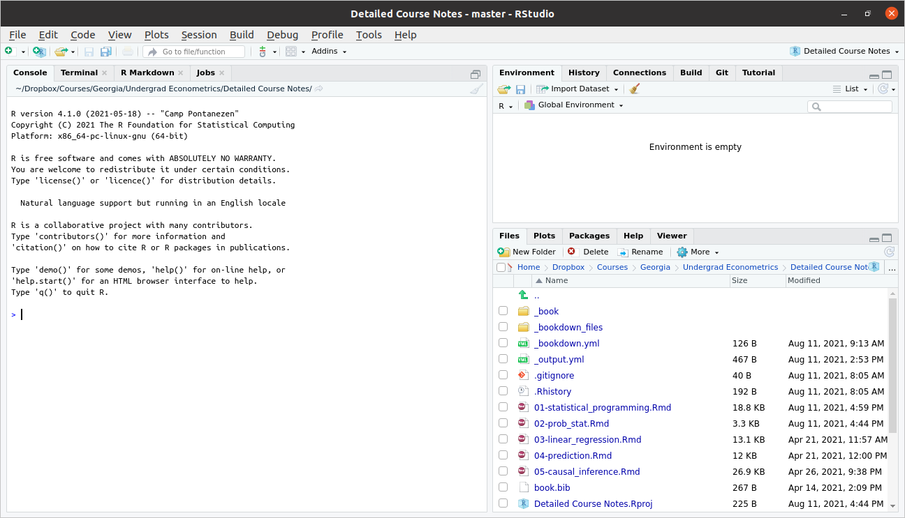
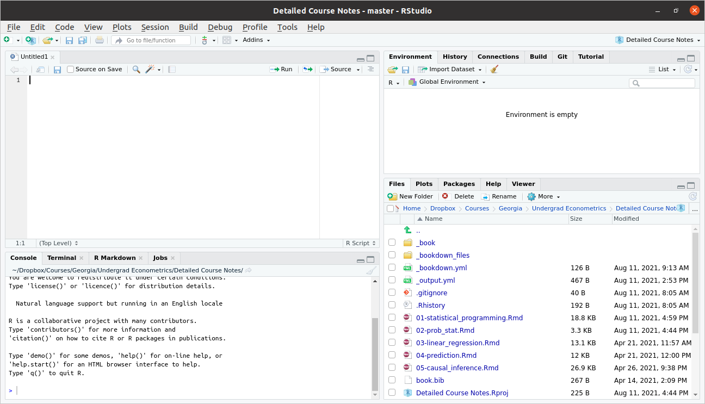

# Statistical Programming

We will learn a lot more about statistical programming this semester, but we'll start with a crash course on `R` with the idea of getting you up-and-running.

I listed a few references in the Introduction, but this section will mostly follow the discussion in [Introduction to Data Science: Data Analysis and Prediction Algorithms with R](https://rafalab.github.io/dsbook/), by Rafael Irizarry.  I'll abbreviate this reference as IDS throughout this section.

IDS is not specifically geared towards Econometrics, but I think it is a really fantastic book and resource.  In this section, I cover what I think are the most important basics of R programming and additionally point you to the references for the material that I cover in class. But I would strongly recommend reading all of the first 5 chapters of IDS over the next couple of weeks.  We will basically only cover the first 5 chapters in our class, but the course should set you up so that the remaining 35 chapters of the book can serve as helpful reference material throughout the rest of the semester.

## Setting up R

This section covers how to set up R and RStudio and then what RStudio will look like when you open it up.

### What is R?

Related Reading: IDS 1.1

R is a statistical programming language.  This is important for two reasons

* It looks like a "real" programming language.  In my view, this is a big advantage.  And many of the programming skills that we will learn in this class will be transferable.  What I mean is that, if you one day want to switch to writing code in Stata or Python, I think the switch should be not-too-painful because learning new "syntax" (things like where to put the semi-colons) is usually relatively easy compared to the "way of thinking" about how to write code.  Some other statistical programming languages are more "canned" than R.  In some sense, this makes them easier to learn, but this also comes with the drawback that whatever skills that you learn are quite specific to that one language.

* Even though R is a real programming language, it is geared towards statistics.  Compared to say, Matlab, a lot of common statistical procedures (e.g., running a regression) will be quite easy for you.

R is very popular among statisticians, computer scientists, economists.

It is easy to share code across platforms: Linux, Windows, Mac.  Besides that, it is easy to write and contribute extensions. I have 10+ R packages that you can easily download and immediately use.


There is a large community, and lots of available, helpful resources.
  
  * First place to look if you don't know how to do something: DuckDuckGo (or...err...Google)!
  
  * StackOverflow
	
	
### Downloading R

We will use R ([https://www.r-project.org/](https://www.r-project.org/)) to analyze data.  R is freely available and available across platforms.  You should go ahead and download R for your personal computer as soon as possible --- this should be relatively straightforward.  It is also available at most computer labs on campus.

### RStudio

Base `R` comes with a lightweight development environment (i.e., a place to write and execute code), but most folks prefer RStudio as it has more features.  You can download it here:  [https://www.rstudio.com/products/rstudio/download/#download](https://www.rstudio.com/products/rstudio/download/#download); choose the free version based on your operating system (Linux, Windows, Mac, etc.).

### RStudio Development Environment

Related Reading: IDS 1.4

When you first open Rstudio, it will look something like this



Typically, we will write **scripts**, basically just as a way to save the code that we have written.  Go to `File -> New File -> R Script`.  This will open up a new pane, and your screen should look something like this



Let's look around here.  The top left pane is called the "Source Pane".  It is where you can write an R script.  Try typing
```{r, eval=FALSE}
1+1
```
in that pane.  This is a very simple R program.  Now, type `Ctrl+s` to save the script.  This will likely prompt you to provide a name for the script.  You can call it `first_script.R` or something like that.  The only thing that really matters is that the file name ends in ".R" (although you should at least give the file a reasonably descriptive name).

Now let's move to the bottom left pane.  This is called the "Console Pane".  It is where the actual computations happen in R (Notice that, although we have already saved our first script, we haven't actually run any code).  Beside the blue arrow in that pane, try typing 

```{r eval=FALSE}
2+2
```
 
and then press `ENTER`.  This time you should actually see the answer.

Now, let's go back to the Source pane.  Often, it is convenient to run R programs line by line (mainly in order for it to be easy for you to digest the results).  You can do this by pressing `Ctrl+ENTER` on any line in your script for it to run next.  Try this on the first line of your script file where we previously typed `1+1`.  This code should now run, and you should be able to see the result down in the bottom left Console pane.

We will ignore the two panes on the right for now and come back to them once we get a little more experience programming in R.

## Installing R Packages

Related Reading: IDS 1.5

When you download `R`, you get "base" `R`.  Base R contains "basic" functions that are commonly used by most R users.  To give some examples, base R gives you the ability add, subtract, divide, or multiply numbers.  Base R gives you the ability to calculate the mean (the function is called `mean`) or standard deviation (the function is called `sd`) of a vector of numbers.

Base R is quite powerful and probably the majority of code you will write in R will only involve Base R.

That being said, there are many cases where it is useful to expand the base functionality of `R`.  This is done through **packages**.  Packages expand the functionality of R.  R is open source so these packages are contributed by users.

It also typically wouldn't make sense for someone to install *all* available R packages.  For example, a geographer might want to install a much different set of packages relative to an economist.  Therefore, we will typically install only the additional functionality that we specifically want.

::: {.example}

In this example, we'll install the `dslabs` package (which is from the IDS book) and the `lubridate` package (which is a package for working with dates in R).

```{r, eval=FALSE}
# install dslabs package
install.packages("dslabs")

# install lubridate package
install.packages("lubridate")
```
:::

Installing a package is only the first step to using a package.  You can think of installing a package like *downloading* a package.  To actually use a package, you need to load it into memory (i.e., "attach" it) or at least be clear about the package where a function that you are trying to call comes from.

::: {.example}

Dates can be tricky to work with in R (and in programming languages generally).  For example, they are not exactly numbers, but they also have more structure than just a character string.  The `lubridate` package contains functions for converting numbers/strings into dates.

```{r message=FALSE}
bday <- "07-15-1985"
class(bday) # R doesn't know this is actually a date yet

# load the package
library(lubridate)
# mdy stands for "month, day, year"
# if date were in different format, could use ymd, etc.
date_bday <- mdy(bday)
date_bday
# now R knows this is a date
class(date_bday)
```

Another (and perhaps better) way to call a function from a package is to use the `::` syntax.  In this case, you do not need the call to `library` from above.  Instead, you can try

```{r}
lubridate::mdy(bday)
```
This does exactly the same thing as the code before.  What is somewhat better about this code is that it is easier to tell that the `mdy` function came from the `lubridate` package.

:::

### A list of useful R packages

* `AER` --- package containing data from *Applied Econometrics with R*

* `wooldridge` --- package containing data from Wooldridge's text book

* `ggplot2` --- package to produce sophisticated looking plots

* `dplyr` --- package containing tools to manipulate data

* `haven` --- package for loading different types of data files

* `plm` --- package for working with panel data

* `fixest` --- another package for working with panel data

* `ivreg` --- package for IV regressions, diagnostics, etc.

* `estimatr` --- package that runs regressions but with standard errors that economists often like more than the default options in `R`

* `modelsummary` --- package for producing nice output of more than one regression and summary statistics


As of this writing, there are currently 18,004 R packages available on CRAN (R's main repository for contributed packages).  

## R Basics

Related Reading: IDS 2.1

In this section, we'll start to work towards writing useful R code.

### Objects

Related Reading: IDS 2.2

The very first step to writing code that can actually do something is to able to store things.  In R, we store things in **objects** (perhaps sometimes I will also use the word variables). 

Earlier, we used R to calculate $1+1$.  Let's go back to the Source pane (top left pane in RStudio) and type

```{r}
answer <- 1 + 1
```

Press `Ctrl+ENTER` on this line to run it.  You should see the same line down in the Console now.

Let's think carefully about what is happening here

* `answer` is the name of the variable (or object) that we are creating here.

* the `<-` is the **assignment** operator.  It means that we should *assign* whatever is on the right hand side of it to the variable that is on the left hand side of it

* `1+1` just computes $1+1$ as we did earlier.  Soon we will put more complicated expressions here.

You can think about the above code as computing $1+1$ and then *saving* it in the variable `answer`.  

::: {.side-comment}
<span class="side-comment">Side Comment:</span> The assignment operator, `<-`, is a "less than sign" followed by a "hyphen".  It's often convenient though to use the keyboard shortcut `Alt+-` (i.e., hold down `Alt` and press the hypen key) to insert it.  You can also use an `=` for assignment, but this is less commonly done in R.
:::

::: {.practice}
<span class="practice">Practice:</span> Try creating variable called `five_squared` that is equal to $5 \times 5$ (multiplication in R is done using the `*` symbol).  
:::

There are a number of reasons why you might like to create an object in R.  Perhaps the main one is so that you can reuse it.  Let's try multiplying `answer` by $3$.
```{r}
answer*3
```
If you wanted, you could also save this as its own variable too.

### Workspace

Related Reading: IDS 2.2

Before we move on, I just want to show you what my workspace looks like now.


As we talked about above, you can see the code in my script in the Source pane in the top left.  You can also see the code that I actually ran in the Console pane on the bottom left.  

Now, take a look at the top right pane.  You will see under the Environment tab that `answer` shows up there with a value of `2`.  The Environment tab keeps track of all the variables that you have created in your current session.  A couple of other things that might be useful to point out there.  

* Later on in the class, we will often import data to work with.  The "Import Dataset" button that is located in this top right pane is often useful for this.

* Occasionally, you might get into the case where you have saved a bunch of variables and it would be helpful to "start over".  The broom in this pane will "clean" your workspace (this just means delete everything).

### Importing Data

To work with actual data in R, we will need to import it.  I mentioned the "Import Data" button above, but let me mention a few other possibilities here, including how to import data by writing code.

On the course website, I posted three files `firm.data.csv`, `firm_data.RData`, and `firm_data.dta`.  All three of these contain exactly the same small, fictitious dataset, but are saved in different formats.  

Probably the easiest way to import data in R is through the Files pane on the bottom right.  In particular, suppose that you saved `firm_data.csv` in your "Downloads" folder.  Try clicking the "..." (which, in the screenshot of my workspace above, is right beside the folder that I am in which is called "Detailed Course Notes"), then select your Downloads folder.  This will switch the content of the Files pane to show the files in your Downloads folder.  Now click `firm_data.csv`.  This will open a menu to import the data.  `R` is quite good at recognizing different types of data files and importing them, so this same procedure will work for `firm_data.RData` and `firm_data.dta` even though they are different types of files.

Next, let's discuss how to import data by writing computer code (by the way, this is actually what is happening behind the scenes when you import data through the user interface as described above).  "csv" stands for "Comma Separated Values".  This is basically a plain text file (e.g., try opening it in Notepad or Text Editor) where the columns are separated by commas and the rows are separated by being on different lines.  Most any computer program can read this type of file; that is, you could easily import this file into, say, R, Excel, or Stata.  You can import a `.csv` file using `R` code by

```{r, eval=FALSE}
firm_data <- read.csv("firm_data.csv")
```

An `RData` file is the native format for saving data in `R`.  You can import an `RData` file using the following command:

```{r, eval=FALSE}
firm_data <- load("firm_data.RData")
```

Similarly, a `dta` file the native format for saving data in Stata.  You can import a `dta` file using the following command:

```{r, eval=FALSE}
library(haven) # external package for reading dta file
firm_data <- read_dta("firm_data.dta")
```

In all three cases above, what we have done is to create a new `data.frame` (a `data.frame` is a type of object that we'll talk about in detail later on in this chapter) called `firm_data` that contains the data that we were trying to load.


## Functions in R

Related Reading: IDS 2.2

R has a large number of helpful, built-in functions.  Let's start with a pretty representative example: computing logarithms.  This can be done using the R function `log`.

```{r}
log(5)
```

You can tell this is a function because of the parentheses.  The `5` inside of the parentheses is called the **argument** of the function.  As practice, try computing the $\log$ of 7.

::: {.side-comment}
<span class="side-comment">Side Comment:</span> As a reminder, the logarithm of some number, let's call it $b$, is is the value of $a$ that solves $\textrm{base}^a = b$.  
:::

The default base in R is $e \approx 2.718$, so that `log(5)` actually computes what you might be more used to calling the "natural logarithm".  You can change the default value of the base by adding an extra argument to the function.

```{r}
log(5, base=10)
```

In order to learn about what arguments are available (and what they mean), you can access the help files for a particular function by running either

```{r, eval=FALSE}
help(log)
?log
```
and, of course, substituting the name of whatever function you want to learn about in place of `log`.

In RStudio, it can also be helpful to press `Tab` and RStudio will provide possible completions to the function you are typing as well as what arguments can be provided to that function.


::: {.practice}
<span class="practice">Practice:</span> R has a function for computing absolute value (you'll have to find the name of it on your own).  Try computing the absolute value of $5$ and $-5$.  Try creating a variable called `negative_three` that is equal to $-3$; then, try to compute the absolute value of `negative_three`.
:::


## Data types 

Related Reading: IDS 2.4

### Numeric Vectors

The most basic data type in `R` is the vector.  In fact, above when we created variables that were just a single number, they are actually stored as a numeric vector.

To more explicitly create a vector, you can use the `c` function in `R`.  For example, let's create a vector called `five` that contains the numbers 1 through 5.

```{r}
  five <- c(1,2,3,4,5)
```

We can print the contents of the vector `five` just by typing its name

```{r}
five
```

Another common operation on vectors is to get a particular element of a vector.  Let me give an example
```{r}
five[3]
```
This code takes the vector `five` and returns the third element in the vector.  Notice that the above line contains braces, `[` and `]` rather than parentheses.

If you want several different elements from a vector, you can do the following
```{r}
five[c(1,4)]
```
This code takes the vector `five` and returns the first and fourth element in the vector.

One more useful function for vectors is the function `length`.  This tells you the number of elements in vector.  For example,
```{r}
length(five)
```
which means that there are five total elements in the vector `five`.

### Vector arithmetic

Related Reading: IDS 2.11

The main operations on numeric vectors are `+`, `-`, `*`, `/` which correspond to addition, subtraction, multiplication, and division.  Often, we would like to carry out these operations on vectors.  

There are two main cases.  The first case is when you try to add a single number (i.e., a scalar) to all the elements in a vector.  In this setup, the operation will happen element-wise which means the same number will be added to all numbers in the vector.  This will be clear with some examples.

```{r}
five <- c(1,2,3,4,5)

# adds one to each element in vector
five + 1

# also adds one to each element in vector
1 + five
```

Similar things will happen with the other mathematical operations above.  Here are some more examples:
```{r}
five * 3

five - 3

five / 3
```

The other interesting case is what happens when you try to apply any of the same mathematical operators to two different vectors.  

```{r}
# just some random numbers
vec2 <- c(8,-3,4,1,7)

five + vec2

five - vec2

five * vec2

five / vec2
```

You can immediately see what happens here.  For example, for `five + vec2`, the first element of `five` is added to the first element of `vec2`, the second element of `five` is added to the second element of `vec2` and so on.  Similar things happen for each of the other mathematical operations too.

There's one other case that might be interesting to consider too.  What happens if you try to apply these mathematical operations to two vectors of different lengths?  Let's find out
```{r}
vec3 <- c(2,6)
five + vec3
```
You'll notice that this computes *something* but it also issues a warning.  What happens here is that the result is equal to the first element of `five` plus the first element of `vec3`, the second of `five` plus the second element of `vec3`, the third element of `five` plus *the first element of `vec3`*, the fourth element of `five` plus *the second element of `vec3`*, and the fifth element of `five` plus *the first element of `vec3`*.  What's happening here is that, since `vec3` contains fewere elements that `five`, the elements of `vec3` are getting *recycled*.  In my experience, this warning often indicates a coding mistake.  There are many cases where I want to add the same number to all elements in a vector, and many other cases where I want to add two vectors that have the same length, but I cannot think of any cases where I would want to add two vectors the way that is being carried out here. 

The same sort of things will happen with subtraction, multiplication, and division (feel free to try it out).

### More helpful functions in R

This is definitely an incomplete list, but I'll point you here to some more functions in R that are often helpful along with quick examples of them.

* `seq` function --- creates a "sequence" of numbers

  ```{r}
  seq(2,7)
  ```
  
* `sum` function --- computes the sum of a vector of numbers

  ```{r}
  sum(c(1,5,8))
  ```
  
* `sort`, `order`, and `rev` functions --- functions for understanding the order or changing the order of a vector

  ```{r}
  sort(c(3,1,5))
  order(c(3,1,5))
  rev(c(3,1,5))
  ```
  
* `%%` --- modulo function (i.e., returns the remainder from dividing one number by another)

  ```{r}
  8 %% 3
  1 %% 3
  ```

::: {.practice}
<span class="practice">Practice:</span> The function `seq` contains an optional argument `length.out`.  Try running the following code and seeing if you can figure out what `length.out` does.
```{r eval=FALSE}
seq(1,10,length.out=5)
seq(1,10,length.out=10)
seq(1.10,length.out=20)
```
:::


### Other types of vectors

There are other types of vectors in R too.  Probably the main two other types of vectors are **character vectors** and **logical vectors**.  We'll talk about character vectors here and defer logical vectors until later.  Character vectors are often referred to as **strings**.

We can create a character vector as follows

```{r}
string1 <- "econometrics"
string2 <- "class"
string1
```
The above code creates two character vectors and then prints the first one.

::: {.side-comment}
<span class="side-comment">Side Comment</span> `c` stands for "concatenate".  Concatenate is a computer science word that means to combine two vectors.  Probably the most well known version of this is "string concatenation" that combines two vectors of characters.  Here is an example of string concatenation.

```{r}
c(string1, string2)
```
Sometimes string concatenation means to put two (or more strings) into the same string.  This can be done using the `paste` command in R.
```{r}
paste(string1, string2)
```
Notice that `paste` puts in a space between `string1` and `string2`.  For practice, see if you can find an argument to the `paste` function that allows you to remove the space between the two strings.
:::


### Data Frames

Another very important type of object in R is the **data frame**.  I think it is helpful to think of a data frame as being very similar to an Excel spreadsheet --- sort of like a matrix or a two-dimensional array.  Each row typically corresponds to a particular observation, and each column typically provides the value of a particular variable for that observation.  

Just to give a simple example, suppose that we had firm-level data about the name of the firm, what industry a firm was in, what county they were located in, and their number of employees.  I created a data frame like this (it is totally made up, BTW) and show it to you next
```{r eval=FALSE}
firm_data
```

```{r echo=FALSE, results="asis"}
firm_data <- data.frame(name=c("ABC Manufacturing", "Martin\'s Muffins", "Down Home Appliances", "Classic City Widgets", "Watkinsville Diner"),
                        industry=c("Manufacturing", "Food Services", "Manufacturing", "Manufacturing", "Food Services"),
                        county=c("Clarke", "Oconee", "Clarke", "Clarke", "Oconee"),
                        employees=c(531, 6, 15, 211, 25))
knitr::kable(firm_data)
```

::: {.side-comment}
<span class="side-comment">Side Comment:</span> If you are following along on R, I created this data frame using the following code
```{r}
firm_data <- data.frame(name=c("ABC Manufacturing", "Martin\'s Muffins", "Down Home Appliances", "Classic City Widgets", "Watkinsville Diner"),
                        industry=c("Manufacturing", "Food Services", "Manufacturing", "Manufacturing", "Food Services"),
                        county=c("Clarke", "Oconee", "Clarke", "Clarke", "Oconee"),
                        employees=c(531, 6, 15, 211, 25))
```

This is also the same data that we loaded earlier in Section 2.3.

:::

Often, we'll like to access a particular column in a data frame.  For example, you might want to calculate the average number of employees across all the firms in our data.

Typically, the easiest way to do this, is to use the **accessor** symbol, which is `$` in R.  This will make more sense with an example:

```{r}
firm_data$employees
```

`firm_data$employees` just provides the column called "employees" in the data frame called "firm_data".  You can also notice that `firm_data$employees` is just a numeric vector.  This means that you can apply any of the functions that we have been covering on it

```{r}
mean(firm_data$employees)

log(firm_data$employees)
```

::: {.side-comment}
<span class="side-comment">Side Comment:</span> Notice that the function `mean` and `log` behave differently.  `mean` calculates the average over all the elements in the vector `firm_data$employees` and therefore returns a single number.  `log` calculates the logarithm of each element in the vector `firm_data$employees` and therefore returns a numeric vector with five elements.
:::

::: {.side-comment}
<span class="side-comment">Side Comment:</span>

The `$` is not the only way to access the elements in a data frame.  You can also access them by their position.  For example, if you want whatever is in the third row and second column of the data frame, you can get it by

```{r}
firm_data[3,2]
```

Sometimes it is also convenient to recover a particular row or column by its position in the data frame.  Here is an example of recovering the entire fourth row
```{r}
firm_data[4,]
```
Notice that you just leave the "column index" (which is the second one) blank
:::

::: {.side-comment}
<span class="side-comment">Side Comment:</span> One other thing that sometimes takes some getting used to is that, for programming in general, you have to be very precise.  Suppose you were to make a very small typo.  R is not going to understand what you mean.  See if you can spot the typo in the next line of code.

```{r, error=TRUE}
firm_data$employes
```

:::

A few more useful functions for working with data frames are:

- `nrow` and `ncol` --- returns the number of rows or columns in the data frame

- `colnames` and `rownames` --- returns the names of the columns or rows


### Lists

Vectors and data frames are the main two types of objects that we'll use this semester, but let me give you a quick overview of a few other types of objects.  Let's start with **lists**.  Lists are very generic in the sense that they can carry around complicated data.  If you are familiar with any object oriented programming language like Java or C++, they have the flavor of an "object", in the object-oriented sense.  

I'm not sure if we will see any examples this semester where you *have* to use a list. But here is an example.  Suppose that we wanted to put the vector that we created earlier `five` and the data frame that we created earlier `firm_data` into the same object.  We could do it as follows

```{r}
unusual_list <- list(numbers=five, df=firm_data)
```

You can access the elements of a list in a few different ways.  Sometimes it is convenient to access them via the `$` 
```{r}
unusual_list$numbers
```
Other times, it is convenient to access them via their position in the list
```{r}
unusual_list[[2]] # notice the double brackets
```

### Matrices

Matrices are very similar to data frames, but the data should all be of the same type.  Matrices are very useful in some numerical calculations that are beyond the scope of this class.  Here is an example of a matrix.

```{r}
mat <- matrix(c(1,2,3,4), nrow=2, byrow=TRUE)
mat
```
You can access elements of a matrix by their position in the matrix, just like for the data frame above.
```{r}
# first row, second column
mat[1,2]
# all rows in second column
mat[,2] 
```

### Factors

Sometimes variables in economics are **categorical**.  This sort of variable is somewhat between a numeric variable and a string.  In `R`, categorical variables are called **factors**.

A good example of a categorical variable is `firm_data$industry`.  It tells you the "category" of the industry that a firm is in.  

Oftentimes, we may have to tell R that a variable is a "factor" rather than just a string.  Let's create a variable called `industry` that contains the industry from `firm_data` but as a factor.

```{r}
industry <- as.factor(firm_data$industry)
industry
```

A useful package for working with factor variables is the `forcats` package.


### Understanding an object in R

Sometimes you may be in the case where there is a variable where you don't know what exactly it contains.  Some functions that are helpful in this case are

* `class` --- tells you, err, the class of an object (i.e., its "type")

* `head` --- shows you the "beginning" of an object; this is especially helpful for large objects (like some data frames)

* `str` --- stands for "structure" of an object

Let's try these out
```{r}
class(firm_data)
# typically would show the first five rows of a data frame,
# but that is the whole data frame here
head(firm_data) 
str(firm_data)
```

::: {.practice}
<span class="practice">Practice:</span> Try running `class`, `head`, and `str` on the vector `five` that we created earlier.
:::


## Logicals

Related Reading: IDS 2.13

All programming languages have ways of tracking whether variables meet certain criteria.  These are often called Booleans or Logicals.  For us, this will particularly come up in the context of subsetting data (i.e., selecting data based on some condition) and in running particular portions of code based on some condition.

Some main logical operators are `==`, `<=`, `>=`, `<`, `>` corresponding to whether or not two things are equal, less than or equal to, greater than or equal, strictly less than, and strictly greater than.  These can be applied to vectors.  And the comparisons result in either `TRUE` or `FALSE`.  Here are some examples

```{r}
five <- c(1,2,3,4,5)

# only 3 is equal to 3
five == 3

# 1,2,3 are all less than or equal to 3
five <= 3

# 3,4,5, are all greater than or equal to 3
five >= 3

# 1,2 are strictly less than 3
five < 3

# 4,5 are strictly greater than 3
five > 3
```

::: {.example}

Often, we might be interested in learning about a subset of our data.  As a simple example, using our `firm_data` from earlier, you could imagine being interested in average employment for manufacturing firms. 

We can do this using the `subset` function along with the logical operations we've learned in this section.

```{r}
manufacturing_firms <- subset(firm_data, industry=="Manufacturing")
mean(manufacturing_firms$employees)
```

As practice, try creating a subset of `firm_data` based on firms having more than 100 employees.
:::

### Additional Logical Operators

Related Reading: IDS 2.13

There are a number of additional logical operators that can be useful in practice.  Here, we quickly cover several more.

* `!=` --- not equal

  ```{r}
  c(1,2,3) != 3
  ```

* We can link together multiple logical comparisons.  If we want to check whether multiple conditions hold, we can use "logical AND" `&`; if we want to check whether any of multiple conditions hold, we can use "logical OR" `|`.

  ```{r}
  # AND
  ( c(1,2,3,4,5) >= 3 ) & ( c(1,2,3,4,5) < 5 )
  
  # OR
  ( c(1,2,3,4,5) >= 4 ) | ( c(1,2,3,4,5) < 2 )
  ```

* `%in%` --- checks whether the elements of one vector show up *in* another vector

  ```{r}
  # 1 is in the 2nd vector, but 7 is not
  c(1,7) %in% c(1,2,3,4,5)
  ```

* Often it is useful to check whether any logical conditions are true or all logical conditions are true.  This can be done as follows

  ```{r}
  # this one is TRUE because 1 is in the 2nd vector  
  any(c(1,7) %in% c(1,2,3,4,5))

  # this one is FALSE because 7 is not in the 2nd vector
  all(c(1,7) %in% c(1,2,3,4,5))
  ```


## Programming basics

### Writing functions

Related Reading: IDS 3.2

It is often helpful to write your own functions in R.  If you ever find yourself repeating the same code over and over, this suggests that you should write this code as a function and repeatedly call the function.

Suppose we are interesting in solving the quadratic equation
$$
  ax^2 + bx + c = 0
$$
If you remember the quadratic formula, the solution to this equation is
$$
  x = \frac{-b \pm \sqrt{b^2-4ac}}{2a}
$$
It would be tedious to calculate this by hand (especially if we wanted to calculate it for many different values of $a$, $b$, and $c$), so let's write a function to do it.

```{r}
quadratic_solver <- function(a, b, c) {
  root1 <- ( -b + sqrt(b^2 - 4*a*c) ) / 2*a
  root1
}
```

Before we try this out, let's notice a few things.  First, while this particular function is for solving the quadratic equation, this is quite representative of what a function looks like in R.

* `quadratic_solver` --- This is the name of the function.  It's good to give your function a descriptive name related to what it does.  But you could call it anything you want.  If you wanted to call this function `uga`, it would still work.

* the part `<- function` finishes off assigning the function the name `quadratic_solver` and implies that we are writing down a function rather than a `vector` or `data.frame` or something else.  This part will show up in all function definitions.

* the part `(a, b, c)`, `a`, `b`, and `c` are the names of the *arguments* to the function.  In a minute when we call the function, we need to tell the function the particular values of `a`, `b`, and `c` for which to solve the quadratic equation.  We could name these whatever we want, but, again, it is good to have descriptive names.  When you write a different function, it can have as many arguments as you want it to have.

* the part `{ ... }` everything that the function does should go between the curly brackets

* the line `root1 <- ( -b + sqrt(b^2 - 4*a*c) ) / 2*a` contains the main thing that is calculated by our function.  Notice that we only calculate one of the "roots" (i.e., solutions to the quadratic equation) because of the $+$ in this expression.

* the line `root1` R returns whatever variable is on the last line of the function.  It might be somewhat more clear to write `return(root1)`.  The behavior of the code would be exactly the same, but it is just the more common "style" in R programming to not include the explicit `return`.

Now let's try out our function
```{r}
# solves quadratic equation for a=1, b=4, c=3
quadratic_solver(1,4,3)

# solves quadratic equation for a=-1, b=5, c=10
quadratic_solver(-1,5,10)
```

Two last things that are worth pointing out about functions:

* Functions in R can be set up to take default values for some of their arguments

* Because the arguments have names, if you are explicit about the name of the argument, then the order of the argument does not matter.

To give examples, let's write a slightly modified version of our function to solve quadratic equations.

```{r}
quadratic_solver2 <- function(a=1, b, c) {
  root1 <- ( -b + sqrt(b^2 - 4*a*c) ) / 2*a
  root1
}
```
The only thing different here is that `a` takes the default value of 1.  Now let's try some different calls to `quadratic_solver` and `quadratic_solver2`

```{r, error=TRUE}
# solve again for a=1,b=4,c=3
quadratic_solver2(b=4,c=3)

# replace default and change order
quadratic_solver2(c=10,b=5,a=-1)

# no default set for quadratic_solver so it will crash if a not provided
quadratic_solver(b=4,c=3)
```

### if/else

Related Reading: IDS 3.1

Often when writing code, you will want to do different things depending on some condition.  Let's write a function that takes in the number of employees that are in a firm and prints "large" if the firm has more than 100 employees and "small" otherwise.

```{r}
large_or_small <- function(employees) {
  if (employees > 100) {
    print("large")
  } else {
    print("small")
  }
}
```
I think, at this point, this code should make sense to you.  The only new thing is the if/else.  The following is not code that will actually run but is just to help understand the logic of if/else.
```{r eval=FALSE}
if (condition) {
  # do something
} else {
  # do something else
}
```
All that happens with if/else is that we check whether `condition` evaluate to `TRUE` or `FALSE`.  If it is `TRUE`, the code will do whatever is inside the first set of brackets; if it is `FALSE`, the code will do whatever is in the set of brackets following `else`.

### for loops

Related Reading: IDS 3.4

Often, we need to run the same code over and over again.  A `for` loop is a main programming tool for this case (`for` loops show up in pretty much all programming languages).

We'll have more realistic examples later on in the semester, but we'll do something trivial for now.

```{r}
out <- c()
for (i in 1:10) {
  out[i] <- i*3
}
out
```

The above code, starts with $i=1$, calculates $i*3$ (which is 3), and then stores that result in the first element of the vector `out`, then $i$ increases to 2, the code calculates $i*3$ (which is now 6), and stores this result in the second element of `out`, and so on through $i=10$.

### Vectorization

Related Reading: IDS 3.5

Vectorizing functions is a relatively advanced topic in R programming, but it is an important one, so I am including it here.

Because we will often be working with data, we will often be performing the same operation on all of the observations in the data.  For example, suppose that you wanted to take the logarithm of the number of employees for all the firms in `firm_data`.  One way to do this is to use a `for` loop, but this code would be a bit of a mess.  Instead, the function `log` is **vectorized** --- this means that if we apply it to a vector, it will calculate the logarithm of each element in the vector.  Besides this, vectorized functions are often faster than `for` loops.  

Not all functions are vectorized though.  Let's go back to our function earlier called `large_or_small`.  This took in the number of employees at a firm and then printed "large" if the firm had more than 100 employees and "small" otherwise.  Let's see what happens if we call this function on a vector of employees (Ideally, we'd like the function to be applied to each element in the vector).

```{r, error=TRUE}
employees <- firm_data$employees
employees
large_or_small(employees)
```
This is not what we wanted to have happen. Instead of determining whether each firm was large or small, we get an error basically said that something may be going wrong here.  What's going on here is that the function `large_or_small` is not vectorized.

In order to vectorize a function, we can use one of a number of "apply" functions in R.  I'll list them here

* `sapply` --- this stands for "simplify" apply; it "applies" the function to all the elements in the vector or list that you pass in and then tries to "simplify" the result

* `lapply` --- stands for "list" apply; applies a function to all elements in a vector or list and then returns a list

* `vapply` --- stands for "vector" apply; applies a function to all elements in a vector or list and then returns a vector

* `apply` --- applies a function to either the rows or columns of a matrix-like object (i.e., a matrix or a data frame) depending on the value of the argument `MARGIN`

Let's use `sapply` to vectorize `large_or_small`.

```{r}
large_or_small_vectorized <- function(employees_vec) {
  sapply(employees_vec, FUN = large_or_small)
}
```
All that this will do is call the function `large_or_small` for each element in the vector `employees`.  Let's see it in action

```{r}
large_or_small_vectorized(employees)
```

This is what we were hoping for.


::: {.side-comment}
<span class="side-comment">Side Comment:</span> I also typically replace most all `for` loops with an `apply` function.  In most cases, I don't think there is much of a performance gain, but the code seems easier to read (or at least more concise).

Earlier we wrote a function to take a vector of numbers from 1 to 10 and multiply all of them by 3.  Here's how you could do this using `sapply`

```{r}
sapply(1:10, function(i) i*3)
```

which is considerably shorter.  

One last thing worth pointing out though is that multiplication is already vectorized, so you don't actually need to do `sapply` or the `for` loop; a better way is just

```{r}
(1:10)*3
```
:::

::: {.side-comment}
<span class="side-comment">Side Comment:</span> A relatively popular alternative to `apply` functions are `map` functions provided in the `purrr` package.
:::

::: {.side-comment}

<span class="side-comment">Side Comment:</span> It's often helpful to have a vectorized version of if/else.  In `R`, this is available in the function `ifelse`.  Here is an alternative way to vectorize the function `large_or_small`:

```{r}
large_or_small_vectorized2 <- function(employees_vec) {
  ifelse(employees_vec > 100, "large", "small")
}
large_or_small_vectorized2(firm_data$employees)
```
Here you can see that `ifelse` makes every comparison in its first argument, and then returns the second element for every `TRUE` coming from the first argument, and returns the third element for every `FALSE` coming from the first argument.

`ifelse` also works with vectors in the second and third element.  For example:
```{r}
  ifelse(c(1,3,5) < 4, yes=c(1,2,3), no=c(4,5,6))
```
which picks up 1 and 2 from the second (`yes`) argument and 6 from the third (`no`) argument.


:::


## Advanced Topics

To conclude this section, I want to briefly point you towards some advanced material.  We will probably brush up against some of this material this semester.  That being said, R has some very advanced capabilities related to data science, data manipulation, and data visualization.  If you have time/interest you might push further in all of these directions.  By the end of the semester, we may not have mastered these topics, but they should at least be accessible to you. 

### Tidyverse

Related Reading: IDS Chapter 4 --- strongly recommend that you read this

* R has very good data cleaning / manipulating tools

    - Many of them are in the ["tidyverse"](https://www.tidyverse.org/)
    
    - Mostly this semester, I'll just give you a data set that is ready to be worked with.  But as you move to your own research projects or do work for a company one day, you will realize that a major step in analyzing data is organizing ("cleaning") the data in a way that you can analyze it

* Main packages

    - `ggplot2` -- see below
    
    - `dplyr` --- package to manipulate data
    
    - `tidyr` --- more ways to manipulate data
    
    - `readr` --- read in data
    
    - `purrr` --- alternative versions of `apply` functions and `for` loops
    
    - `tibble` --- alternative versions of `data.frame`
    
    - `stringr` --- tools for working with strings
    
    - `forcats` --- tools for working with factors

* I won't emphasize these too much as they are somewhat advanced topics, but if you are interested, these are good (and marketable) skills to have

### Data Visualization

Related Reading: IDS Ch. 6-11 --- `R` has very good data visualization tools; strongly recommend that you read this

* Another very strong point of `R`

* Base `R` comes with the `plot` command, but the `ggplot2` package provides cutting edge plotting tools.  These tools will be somewhat harder to learn, but we'll use `ggplot2` this semester as I think it is worth it.

* 538's graphs produced with ggplot

### Reproducible Research

Related Reading: IDS Ch. 40

* Rmarkdown is a very useful way to mix code and content

* These notes are written in Rmarkdown, and I usually write homework solutions in Rmarkdown

* If you are interested, you can view the source for this book at [http://github.com/bcallaway11/econ_4750_notes](http://github.com/bcallaway11/econ_4750_notes).  The source code for this chapter is in the file `01-statistical-programming.Rmd`.

* If you are interested, [Github](http://github.com) is a very useful version control tool (i.e., keeps track of the version of your project, useful for merging projects, and sharing or co-authoring code) and [Dropbox](http://dropbox.com) (also useful for sharing code).  I use both of these extensively --- in general, I use Github relatively more for bigger projects and more public projects and Dropbox more for smaller projects and early versions of projects.

### Technical Writing Tools

This is largely beyond the scope of the course, but, especially for students in ECON 6750, I recommend that you look up Latex.  This is a markup language mainly for writing technical, academic writing.  The big payoff is on writing mathematical equations.  The equations in the Course notes are written in Latex.

An easy way to get started here is to use the website [Overleaf](http://www.overleaf.com).  This is also closely related to markdown/R-markdown discussed above (Latex tends to be somewhat more complicate which comes with some associated advantages and disadvantages).  

## Lab 1: Introduction to R Programming

For this lab, we will do several practice problems related to programming in R.

1. Create two vectors as follows

    ```{r}
    x <- seq(2,10,by=2)
    y <- c(3,5,7,11,13)
    ```

    Add `x` and `y`, subtract `y` from `x`, multiply `x` and `y`, and divide `x` by `y` and report your results.

2. The geometric mean of a set of numbers is an alternative measure of central tendency to the more common "arithmetic mean" (this is the mean that we are used to).  For a set of $J$ numbers, $x_1,x_2,\ldots,x_J$, the geometric mean is defined as 

    $$
      (x_1 \cdot x_2 \cdot \cdots \cdot x_J)^{1/J}
    $$

    Write a function called `geometric_mean` that takes in a vector of numbers and computes their geometric mean.  Compute the geometric mean of `c(10,8,13)`

3. Use the `lubridate` package to figure out how many days it has been since Jan. 1, 1981.

4. `mtcars` is one of the data frames that comes packaged with base R.  

    a) How many observations does `mtcars` have?
    
    b) How many columns does `mtcars` have?
    
    c) What are the names of the columns of `mtcars`?
    
    d) Print only the rows of `mtcars` for cars that get at least 20 mpg
    
    e) Print only the rows of `mtcars` that get at least 20 mpg and have at least 100 horsepower (it is in the column called `hp`)
    
    f) Print only the rows of `mtcars` that have 6 or more cylinders (it is in the column labeld `cyl`) or at least 100 horsepower
    
    g) Recover the 10th row of `mtcars`
    
    h) Sort the rows of `mtcars` by mpg (from highest to lowest)
    
    

## Lab 1: Solutions

1.

```{r}
x <- seq(2,10,by=2)
y <- c(3,5,7,11,13)

x+y
x-y
x*y
x/y

```

2. 

```{r}
geometric_mean <- function(x) {
  J <- length(x)
  res <- prod(x)^(1/J)
  res
}

geometric_mean(c(10,8,13))
```

3.

```{r}
the_date <- lubridate::mdy("01-01-1981")
today <- lubridate::mdy("08-23-2021")
today - the_date
```

4. 

    a) 
    
        ```{r}
        nrow(mtcars)
        ```
        
    b)
        ```{r}
        ncol(mtcars)
        ```
        
    c)
        ```{r}
        colnames(mtcars)
        ```
        
    d)
       ```{r}
       subset(mtcars, mpg >= 20)
       ```
       
    e)
       ```{r}
       subset(mtcars, (mpg >= 20) & (hp >= 100))
       ```
    
    f)
       ```{r}
       subset(mtcars, (cyl >= 6) | (hp >= 100))
       ```
       
    g)
       ```{r}
       mtcars[10,]
       ```
       
    h)
       ```{r}
       # without reversing the order, we would order from lowest to smallest
       mtcars[rev(order(mtcars$mpg)),]
       ```
       
## Coding Exercises

1. The `stringr` package contains a number of functions for working with strings.  For this problem create the following character vector in R

    ```{r}
    x <- c("economics", "econometrics", "ECON 4750")
    ```
    
    Install the `stringr` package and use the `str_length` function in the package in order to calculate the length (number of characters) in each element of `x`.
    
2. For this problem, we are going to write a function to calculate the sum of the numbers from 1 to $n$ where $n$ is some positive integer.  There are actually a lot of different ways to do this.  

    * Approach 1: write a function called `sum_one_to_n_1` that uses the R functions `seq` to create a list of numbers from 1 to $n$ and then the function `sum` to sum over that list.
    
    * Approach 2: The sum of numbers from 1 to $n$ is equal to $n(n+1)/2$.  Use this expression to write a function called `sum_one_to_n_2` to calculate the sum from 1 to $n$.  
    * Approach 3: A more brute force approach is to create a list of numbers from 1 to $n$ (you can use `seq` here) and add them up using a `for` loop --- basically, just keep track of what the current total is and add the next number to the total in each iteration of the for loop.  Write a function called `sum_one_to_n_3` that does this.
    
    **Hint:** All of the functions should look like
    ```{r eval=FALSE}
    sum_one_to_n <- function(n) {
      # do something
    }
    ```
    
    Try out all three approaches that you came up with above for $n=100$.  What is the answer?  Do you get the same answer using all three approaches?
    
3. The Fibonacci sequence is the sequence of numbers $0,1,1,2,3,5,8,13,21,34,55,\ldots$ that comes from starting with $0$ and $1$ and where each subsequent number is the sum of the previous two.  For example, the 5 in the sequence comes from adding 2 and 3; the 55 in the sequence comes from adding 21 and 34.  

    a) Write a function called `fibonacci` that takes in a number `n` and computes the nth element in the Fibonacci sequence.  For example `fibonacci(5)` should return `3` and `fibonacci(8)` should return `13`.
  
    b) Consider an alternative sequence where, starting with the third element, each element is computed as the sum of the previous two elements (the same as with the Fibonacci sequence) but where the first two elements can be arbitrary.  Write a function `alt_seq(a,b,n)` where `a` is the first element in the sequence, `b` is the second element in the sequence, and `n` is which element in the sequence to return.  For example, if $a=3$ and $b=7$, then the sequence would be $3,7,10,17,27,44,71,\ldots$ and `alt_seq(a=3,b=7,n=4) = 17`.
 
4.  Write a function `prime` that takes `n` as an argument and returns a vector of all the prime numbers from $1$ to $n$.
    
5. Base `R` includes a data frame called `iris`.  This is data about iris flowers (you can read the details by running `?iris`).

    a) How many observations are there in the entire data frame?
    
    b) Calculate the average `Sepal.Length` across all observations in `iris`.
    
    c) Calculate the average `Sepal.Width` among the `setosa` iris species.
    
    d) Sort `iris` by `Petal.Length` and print the first 10 rows.