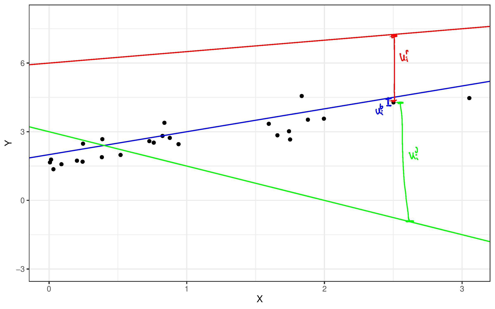

# Linear Regression

In this chapter, our interest will shift to conditional expectations, such as $\E[Y|X_1,X_2,X_3]$ (I'll write $X_1$, $X_2$, and $X_3$ in a lot of examples in this chapter, but you can think of there being an arbitrary number of $X$'s).

I'll refer to $Y$ as the **outcome**.  You might also sometimes heae it called the **dependent variable**.

I'll refer to the $X$'s as either **covariates** or **regressors** or **characteristics**.  You might also hear them called **independent variables** sometimes.

Before we start to get into the details, let us first discuss why we're interested in conditional expectations.  First, if we are interested in *making predictions*, it will often be the case that the "best" prediction that one can make is the conditional expectation.  This should make sense to you --- if you want to make a reasonable prediction about what the outcome will be for a new observation that has characteristics $x_1$, $x_2$, and $x_3$, a good way to do it would be to predict that their outcome would be the same as the mean outcome in the population among those that have the same characteristics; that is, $\E[Y|X_1=x_1, X_2=x_2, X_3=x_3]$.

Next, in economics, we are often interested in how much some outcome of interest changes when a particular covariate changes, holding other covariates constants.  To give some examples, we might be interested in the average return of actively managed mutual funds relative to passively managed mutual funds conditional on investing in assets in the same class (e.g., large cap stocks or international bonds).  As another example, we might be interested in the effect of an increase in the amount of fertilizer on average crop yield but while holding constant the temperature and precipitation.

How much the outcome, $Y$, changes on average when one of the covariates, $X_1$, changes by 1 unit and holding other covariates constant is what we'll call the **partial effect** of $X_1$ on $Y$.  Suppose $X_1$ is binary, then it is given by

$$
  PE(x_2,x_3) = \E[Y | X_1=1, X_2=x_2, X_3=x_3] - \E[Y | X_1=0,X_2=x_2,X_3=x_3]
$$
Notice that the partial effect can depend on $x_2$ and $x_3$.  For example, it could be that the effect of active management relative to passive management could be different across different asset classes.

Slightly more generally, if $X_1$ is discrete, so that it can take on several different discrete values, then we define the partial effect as

$$
  PE(x_1,x_2,x_3) = \E[Y | X_1=x_1+1, X_2=x_2, X_3=x_3] - \E[Y | X_1=x_1,X_2=x_2,X_3=x_3]
$$
which now can depend on $x_1$, $x_2$, and $x_3$.  This is the average effect of going from $X_1=x_1$ to $X_1=x_1+1$ holding $x_2$ and $x_3$ constant.  

Finally, consider the case where we are interested in the partial effect of $X_1$ which is continuous (for example, the partial effect of fertilizer input on crop yield).  In this case the  partial effect is given by the *partial derivative* of $\E[Y|X_1,X_2,X_3]$ with respect to $X_1$.

$$
  PE(x_1,x_2,x_3) = \frac{\partial \, \E[Y|X_1=x_1, X_2=x_2, X_3=x_3]}{\partial \, x_1}
$$
This partial derivative is analogous to what we have been doing before --- we are making a small change of $X_1$ while holding $X_2$ and $X_3$ constant at $x_2$ and $x_3$.

::: {.side-comment}

<span class="side-comment">Side-Comment:</span> This is probably the part of the class where we will jump around in the book the most this semester.  

The pedagogical approach of the textbook is to introduce the notion of causality very early and to emphasize the requirements on linear regression models in order to deliver causality, while increasing the complexity of the models over several chapters.

This is totally reasonable, but I prefer to start by teaching the mechanics of regressions: how to compute them, how to interpret them (even if you are not able to meet the requirements of causality), and how to use them to make predictions.  Then, we'll have a serious discussion about causality over the last few weeks of the semester.  

In practice, this means we'll cover parts Chapters 4-8 in the textbook now, and then we'll circle back to some of the issues covered in these chapters again towards the end of the semester.  

:::

## Nonparametric Regression / Curse of Dimensionality

If you knew nothing about regressions, it would seem natural to try to estimate $\E[Y|X_1=x_1,X_2=x_2,X_3=x_3]$ by just calculating the average of $Y$ among observations that have values of the regressors equal to $x_1$, $x_2$, and $x_3$ (if these are discrete) or that are, in some sense, close to $x_1$, $x_2$, and $x_3$ (if these are continuous).

This is actually a pretty attractive idea.

However, you run into the issue that it is practically challenging to do this when the number of regressors starts to get large (i.e., if you have 10 regressors, generally, you would need tons of data to be able to find a suitable number of observations that are "close" to any particular value of the regressors).  

Let me give a more concrete example.  Suppose that you were trying to estimate mean house price as a function of a house's characteristics.  If the only characteristic of the house that you knew was the number of bedrooms, then it would be pretty easy to just calculate the average house price among houses with 2, 3, 4, etc. bedrooms.  Now suppose that you knew both the number of bedrooms and the number of square feet.  In this case, if we wanted to estimate mean house prices as a function of these characteristics, we would need to find houses that have the same number of bedrooms and (at least) a similar number of square feet.  This starts to "slice" the data that you have more thinly.  If you continue with this idea (suppose that you want to estimate mean house price as a function of number of bedrooms, number of bathrooms, number of square feet, what year the house was built in, whether or not it has a basement, what zip code it is located in, etc.) then you will start to stretch your data extremely thin to the point that you may have very few relevant observations (or perhaps no relevant observations) for particular values of the characteristics.  

This issue is called the "curse of dimensionality".

We will focus on linear models for $\E[Y|X_1,X_2,X_3]$ largely to get around the curse of dimensionality.

::: {.side-comment}

This idea of using observations that are very close in terms of characteristics in order to estimate a conditional expectation is called **nonparametric** econometrics/statistics. You can take entire courses (typically graduate-level) on this topic if you were interested. The reason that it is is called nonparametric is that it doesn't involve making any functional form assumptions (like linearity) but the cost is that it would typically require many more observations (due to the curse of dimensionality).

:::

## Linear Regression Models

SW 4.1

In order to get around the curse of dimensionality that we discussed in the previous section, we will often an impose a **linear model** for the conditional expectation.  For example,

$$
  \E[Y|X] = \beta_0 + \beta_1 X
$$
or

$$
  \E[Y|X_1,X_2,X_3] = \beta_0 + \beta_1 X_1 + \beta_2 X_2 + \beta_3 X_3
$$
If we know the values of $\beta_0$, $\beta_1$, $\beta_2$, and $\beta_3$, then it is straighforward for us to make predictions.  In particular, suppose that we want to predict the outcome for a new observation with characteristics $x_1$, $x_2$, and $x_3$.  Our prediction would be

$$
  \beta_0 + \beta_1 x_1 + \beta_2 x_2 + \beta_3 x_3
$$

::: {.example}

Suppose that you are studying intergenerational income mobility and that you are interested in predicting a child's income whose parents' income was \$50,000 and whose mother had 12 years of education.  Let $Y$ denote child's income, $X_1$ denote parents' income, and $X_2$ denote mother's education.  Further, suppose that $\E[Y|X_1,X_2] = 20,000 + 0.5 X_1 + 1000 X_2$.  

In this case, you would predict child's income to be

$$
  20,000 + 0.5 (50,000) + 1000(12) = 57,000
$$
:::

::: {.side-comment}

<span class="side-comment">Side-Comment:</span>

The above model can be equivalently written as
\begin{align*}
  Y = \beta_0 + \beta_1 X_1 + \beta_2 X_2 + \beta_3 X_3 + U
\end{align*}
where $U$ is called the **error term** and satisfies $\E[U|X_1,X_2,X_3] = 0$.  There will be a few times where this formulation will be useful for us.

:::

## Computation

Even if we know that $\E[Y|X_1,X_2,X_3] = \beta_0 + \beta_1 X_1 + \beta_2 X_2 + \beta_3 X_3$, in general, we do not know the values of the population parameters (the $\beta$'s).  This is analogous to the framework in the previous chapter where we were interested in 
the population parameter $\E[Y]$ and estimated it by $\bar{Y}$.

In this section, we'll discuss how to estimate $(\beta_0,\beta_1,\beta_2,\beta_3)$ using `R`.  We'll refer to the estimated values of the parameters as $(\hat{\beta}_0, \hat{\beta}_1, \hat{\beta}_2, \hat{\beta}_3)$.  As in the previous section, it will not be the case that the estimated $\hat{\beta}$'s are exactly equal to the population $\beta$'s.  Later on in this chapter, we will establish properties like consistency (so that, as long as we have a large sample, the estimated $\hat{\beta}$'s should be "close" to the population $\beta$'s) and asymptotic normality (so that we can conduct inference).

Also later on in this chapter, we'll talk about how `R` itself actually makes these computations.

The main function in `R` for estimating linear regressions is the `lm` function (`lm` stands for linear model).  The key things to specify for running a regression in `R` are a `formula` argument which tells `lm` which variables are the outcome and which variables are the regressors and a `data` argument which tells the `lm` command what data we are using to estimate the regression.  Let's give an example using the `mtcars` data.

```{r}
reg <- lm(mpg ~ hp + wt, data=mtcars)
```

What this line of code does is to run a regression.  The formula is `mpg ~ hp + wt`.  In other words `mpg` (standing for miles per gallon) is the outcome, and we are running a regression on `hp` (horse power) and `wt` (weight).  The `~` symbol is a "tilde".  In order to add regressors, we separate them with a `+`.  The second argument `data=mtcars` says to use the `mtcars` data.  All of the variables in the formula need to correspond to column names in the data.  We saved the results of the regression in a variable called `reg`.  It's most common to report the results of the regression using the `summary` command.

```{r}
summary(reg)
```
The main thing that this reports is the estimated parameters.  Our estimate of the "Intercept" (i.e., this is $\hat{\beta}_0$) is in the first row of the table; our estimate is `37.227`.  The estimated coefficient on `hp` is `-0.0318`, and the estimated coefficient on `wt` is `-3.878`.  

You can also see standard errors for each estimated parameter, a t-statistic, and a p-value in the other columns.  We will talk about these in more detail in the next section.  

For now, we'll also ignore the information provided at the bottom of the summary.

Now that we have estimated the parameters, we can use these to predict $mpg$ given a value of $hp$ and $wt$.  For example, suppose that you wanted to predict the $mpg$ of a 2500 pound car (note: weight in $mtcars$ is in 1000s of pounds) and 120 horsepower car, you could compute

$$
  37.227 - 0.0318(120) - 3.878(2.5) = 23.716
$$
Alternatively, there is a built-in function in `R` called `predict` that can be used to generate predicted values.  We just need to specify the values that we would like to get predicted values for by passing in a data frame with the relevant columns though the `newdata` argument.  For example,

```{r}
pred <- predict(reg, newdata=data.frame(hp=120,wt=2.5))
round(pred,3)
```


:::  {.side-comment}

A popular alternative to `R`'s `lm` function is the `lm_robust` function from the `estimatr` package.  This provides different standard errors from the default standard errors provided by `lm` that are, at least in most applications in economics, typically a better choice --- we'll have a further discussion on this topic when we talk about inference later on in this chapter.

:::


## Partial Effects

As we discussed in the beginning of this chapter, besides predicting outcomes, a second main goal for us is to think about partial effects of a regressor on the outcome.  We'll consider partial effects over the next few sections.

In the model, 
\begin{align*}
  \E[Y | X_1, X_2, X_3]  &= \beta_0 + \beta_1 X_1 + \beta_2 X_2 + \beta_3 X_3
\end{align*}

If $X_1$ is continuous, then 
\begin{align*}
  \beta_1 = \frac{\partial \E[Y|X_1,X_2,X_3]}{\partial X_1}
\end{align*}

Thus, $\beta_1$ is the partial effect of $X_1$ on $Y$.    In other words, $\beta_1$ should be interpreted as how much $Y$ increases, on average, when $X_1$ increases by one unit holding $X_2$ and $X_3$ constant.  *Make sure to get this interpretation right!*


::: {.example}

Continuing the same example as above about intergenerational income mobility and where $Y$ denotes child's income, $X_1$ denotes parents' income, $X_2$ denotes mother's education, and 

$$
  \E[Y|X_1,X_2] = 20,000 + 0.5 X_1 + 1000 X_2
$$
The partial effect of parents' income on child's income is 0.5.  This means that, for every one dollar increase in parents' income, child's income is 0.5 dollars higher on average holding mother's education constant.

:::

### Computation

Let's run the same regression as in the previous section, but think about partial effects in this case.

```{r}
reg1 <- lm(mpg ~ hp + wt, data=mtcars)
summary(reg1)
```

The partial effect of horsepower on miles per gallon is -0.032.  In other words, we estimate that if horsepower increases by one then, on average, miles per gallon decreases by 0.032 holding weight constant.  

The t-statistic and p-value are computed for the null hypothesis that the corresponding coefficient is equal to 0.  For example, for `hp` the t-statistic is equal to `-3.519` which is greater than 1.96 and indicates that the partial effect of `hp` is statistically significant at a 5% significance level.  The corresponding p-value for `hp` is `0.0145` indicating that there is only about a 1.5% chance of getting a t-statistic this extreme if the partial effect of `hp` were actually 0 (i.e., under $H_0 : \beta_1=0$).

::: {.practice}

<span class="practice">Practice: </span>What is the partial effect of `wt` in the previous example?  Provide a careful interpretation.  Is the partial effect of `wt` statistically significant?  Explain.  What is the p-value for `wt`?  How do you interpret the p-value?

:::

::: {.side-comment}

<span class="side-comment">Side-Comment:</span> One horsepower is a very small increase in horsepower, so it might be a good idea to multiply the coefficient by some larger number, say 50.  In this case, we could say that we estimate that if horsepower increases by 50 then, on average, miles per gallon decreases by 1.59 ($=50 \times 0.03177$) holding weight constant.  From the above discussion, we know that this effect is statistically different from 0.  That said, it is not clear to me if we should interpret this as a large partial effect; I do not know too much about cars, but a 50 horsepower increase seems rather large while a 1.59 decrease in miles per gallon seems relatively small (at least to me).

:::

## Binary Regressors

SW 5.3

Let's continue with the same model as above

$$
  \E[Y|X_1,X_2,X_3] = \beta_0 + \beta_1 X_1 + \beta_2 X_2 + \beta_3 X_3
$$

If $X_1$ is discrete (let's say binary):
\begin{align*}
  \beta_1 = \E[Y|X_1=1,X_2,X_3] - \E[Y|X_1=0,X_2,X_3]
\end{align*}
$\beta_1$ is still the partial effect of $X_1$ on $Y$ and should be interpreted as how much $Y$ increases, on average, when $X_1$ changes from 0 to 1, holding $X_2$ and $X_3$ constant.

If $X_1$ can take more than just the values 0 and 1, but is still discrete (an example is a person's years of education), then 

$$
  \beta_1 = \E[Y | X_1=x_1+1, X_2, X_3] - \E[Y|X_1=x_1, X_2, X_3]
$$
which holds for any possible value that $X_1$ could take, so that $\beta_1$ is the effect of a 1 unit increase in $X_1$ on $Y$, on average, holding constant $X_2$ and $X_3$.

::: {.example}

Suppose that you work for an airline and you are interested in predicting the number of passengers for a Saturday morning flight from Atlanta to Memphis.  Let $Y$ denote the number of passengers, $X_1$ be equal to 1 for a morning flight and 0 otherwise, and let $X_2$ be equal to 1 for a weekday flight and 0 otherwise.  Further suppose that $\E[Y|X_1,X_2] = 80 + 20 X_1 - 15 X_2$.  

In this case, you would predict,

$$
  80 + 20 (1) - 15 (0) = 100
$$
passengers on the flight.

In addition, the partial effect of being morning flight is equal to 20.  This indicates that, on average, morning flights have 20 more passengers than non-morning flights holding whether or not the flight occurs on a weekday constant.

:::

### Computation

In order to include a binary or discrete covariate in a regression in `R` is straightforward.  The following regression uses the `mtcars` data and adds a binary regressor, `am`, indicating whether or not a car has an automatic transmission.

```{r}
reg2 <- lm(mpg ~ hp + wt + am, data=mtcars)
summary(reg2)
```

In this example, cars that had an automatic transmission got about 2 more miles per gallon than cars that had an automatic transmission on average, holding horsepower and weight constant (though the p-value is only 0.14).


## Nonlinear Regression Functions

SW 8.1, 8.2

Also, please read all of SW Ch. 8

So far, the the partial effects that we have been interested in have corresponded to a particular parameter in the regression, usually $\beta_1$.  I think this can sometimes be a source of confusion as, at least in my view, we are not typically interested in the parameters for their own sake, but rather are interested in partial effects.  It just so happens that in some leading cases, they coincide.

In addition, while the $\beta$'s in the sort of models we have considered so far are easy to interpret, in some cases, it might be *restrictive* to think that the partial effects are the same across different values of the covariates.

In this section, we'll see the first of several cases where partial effects do not coincide with a particular parameter.

Suppose that

$$ 
  \E[Y|X_1,X_2,X_3] = \beta_0 + \beta_1 X_1 + \beta_2 X_1^2 + \beta_3 X_2 + \beta_4 X_3
$$

Let's start with making predictions using this model.  If you know the values of $\beta_0,\beta_1,\beta_2,\beta_3,$ and $\beta_4$, then to get a prediction, you would still just plug in the values of the regressors that you'd like to get a prediction for (including $x_1^2$).  

Next, in this model, the partial effect of $X_1$ is given by

$$
  \frac{\partial \, \E[Y|X_1,X_2,X_3]}{\partial \, X_1} = \beta_1 + 2\beta_2 X_1
$$
In other words, the partial effect of $X_1$ depends on the value that $X_1$ takes.  

In this case, it is sometimes useful to report the partial effect for some different values of $X_1$.  In other cases, it is useful to report the **average partial effect** (APE) which is the mean of the partial effects across the distribution of the covariates. In this case, the APE is given by

$$
  APE = \beta_1 + 2 \beta_2 \E[X_1]
$$
and, once you have estimated the regression, you can compute an estimate of $APE$ by

$$
  \widehat{APE} = \hat{\beta}_1 + 2 \hat{\beta}_2 \bar{X}_1
$$

::: {.example}

Let's continue our example on intergenerational income mobility where $Y$ denotes child's income, $X_1$ denotes parents' income, and $X_2$ denotes mother's education.  Now, suppose that

$$
  \E[Y|X_1,X_2] = 15,000 + 0.7 X_1 - 0.000002 X_1^2 + 800 X_2
$$
Then, predicted child's income when parents' income is equal to \$50,000 is given by

$$
  15,000 + 0.7 (50,000) - 0.000002 (50,000)^2 + 800 (12) = 54,600
$$
In addition, the partial effect of parents' income is given by

$$
  0.7 - 0.000004 X_1 
$$
Let's compute a few different partial effects for different values of parents' income

| $X_1$ | PE |
|:-------------:|:-------------:|
| 20,000 | 0.62 |
| 50,000 | 0.50 | 
| 100,000 | 0.30 | 

which indicates that the partial effect of parents' income is decreasing --- i.e., the effect of additional parents' income is largest for children whose parents have the lowest income and gets smaller for those whose parents have high incomes.

Finally, if you wanted to compute the $APE$, you would just plug in $\E[X_1]$ (or $\bar{X}_1$) into the expression for the partial effect.

:::

### Computation

Including a quadratic (or other higher order term) in `R` is relatively straightforward.  Let's just do an example.

```{r}
reg3 <- lm(mpg ~ hp + I(hp^2), data=mtcars)
summary(reg3)
```
The only thing that is new here is `I(hp^2)`.  The `I` function stands for inhibit (you can read the documentation using `?I`).  For us, this is not too important.  You can understand it like this: there is no variable names `hp^2` in the data, but if we put the name of a variable that is in the data (here: `hp`) then we can apply a function to it (here: squaring it) before including it as a regressor.

Interestingly, here it seems there are nonlinear effects of horsepower on miles per gallon.  Let's just quickly report the estimated partial effects for a few different values of horsepower.

```{r}
hp_vec <- c(100,200,300)
# there might be a native function in r
# to compute these partial effects; I just
# don't know it.
pe <- function(hp) {
  # partial effect is b1 + 2b2*hp
  pes <- coef(reg3)[2] + 2*coef(reg3)[3]*hp
  # print using a data frame
  data.frame(hp=hp, pe=round(pes,3))
}
pe(hp_vec)
```
which suggests that the partial effect of horsepower on miles per gallon is large (though negative) at small values of horsepower and decreasing up to essentially no effect at larger values of horsepower.

## Interpreting Interaction Terms

SW 8.3

Another way to allow for partial effects that vary across different values of the regressors is to include **interaction terms**.

Consider the following regression model

$$
  \E[Y|X_1,X_2,X_3] = \beta_0 + \beta_1 X_1 + \beta_2 X_2 + \beta_3 X_1 X_2 + \beta_4 X_3
$$

The term $X_1 X_2$ is called the interaction term.  In this model, the partial effect of $X_1$ is given by

$$
  \frac{\partial \, \E[Y|X_1,X_2,X_3]}{\partial \, X_1} = \beta_1 + \beta_3 X_2
$$

In this model, the effect of $X_1$ varies with $X_2$.  As in the previous section, you could report the partial effect for different values of $X_2$ or consider $APE = \beta_1 + \beta_3 \E[X_2]$.

There are a couple of other things worth pointing out for interaction terms

- It is very common for one of the interaction terms, say, $X_2$ to be a binary variable.  This gives a way to easily test if the effect of $X_1$ is the same across the two "groups" defined by $X_2$.  For example, suppose you wanted to check if the partial effect of education was the same for men and women.  You could run a regression like

    $$
      Wage = \beta_0 + \beta_1 Education + \beta_2 Female + \beta_3 Education \cdot Female + U
    $$

    From the previous discussion, the partial effect of education is given by

    $$
      \beta_1 + \beta_3 Female
    $$

    Thus, the partial effect education for men is given by $\beta_1$, and the partial effect of education for women is given by $\beta_1 + \beta_3$.  Thus, if you want to test if the partial effect of education differs for men and women, you can just test if $\beta_3=0$.  If $\beta_3>0$, it suggests a higher partial effect of education for women, and if $\beta_3 < 0$, it suggests a lower partial effect of education for women.

- Another interesting case is when $X_1$ and $X_2$ are both binary.  In this case, a model that includes an interaction term is called a **saturated model**.  It is called this because it is actually nonparametric.  In particular, notice that in the model $\E[Y|X_1,X_2] = \beta_0 + \beta_1 X_1 + \beta_2 X_2 + \beta_3 X_1 X_2$,

    $$
    \begin{aligned}
      \E[Y|X_1=0,X_2=0] &= \beta_0 \\
      \E[Y|X_1=1,X_2=0] &= \beta_0 + \beta_1 \\
      \E[Y|X_1=0,X_2=1] &= \beta_0 + \beta_2 \\
      \E[Y|X_1=1,X_2=1] &= \beta_0 + \beta_1 + \beta_2 + \beta_3
    \end{aligned}
    $$
    
    This exhausts all possible combinations of the regressors and means that you can recover each possible value of the conditional expectation from the parameters of the model.
    
    It would be possible to write down a saturated model in cases with more than two binary regressors (or even discrete regressors) --- you would just need to include more interaction terms.  The key thing is that there be no continuous regressors.  That said, as you start to add more and more discrete regressors and their interactions, you will effectively start to run into the curse of dimensionality issues that we discussed earlier.
    
    As an example, consider our earlier example of flights from Atlanta to Memphis where $Y$ denoted the number of passengers, $X_1$ was equal to 1 for a a morning flight and 0 otherwise, and $X_2$ was equal to one for a weekday flight and 0 otherwise.  Suppose that $\E[Y|X_1,X_2] = 90 - 15 X_1 - 5 X_2 + 25 X_1 X_2$.  Then, 
    
    $$
    \begin{aligned}
      \E[Y|X_1=0,X_2=0] &= 90 \quad & \textrm{non-morning, weekend} \\
      \E[Y|X_1=1,X_2=0] &= 90 - 15 = 75 \quad & \textrm{morning, weekend} \\
      \E[Y|X_1=0,X_2=1] &= 90 - 5 = 85 \quad  & \textrm{non-morning, weekday} \\
      \E[Y|X_1=1,X_2=1] &= 90 - 15 - 5 + 25 = 100 \quad & \textrm{morning, weekend}
    \end{aligned}
    $$

### Computation

Including interaction terms in regressions in `R` is straightforward.  Using the `mtcars` data, we can do it as follows

```{r}
reg4 <- lm(mpg ~ hp + wt + am + hp*am, data=mtcars)
summary(reg4)
```

The interaction term in the results is in the row that starts with `hp:am`.  These estimates suggest that, while horsepower does seem to decrease miles per gallon controlling for weight and whether or not the car has an automatic transmission, the effect of horsepower does not seem to vary much by whether or not the car has an automatic transmission (at least not in a big enough way that we can detect it with the data that we have).  

## Elasticities

SW 8.2

Economists are often interested in **elasticities**, that is, the percentage change in $Y$ when $X$ changes by 1%.

Recall that the definition of percentage change of moving from, say, $x_{old}$ to $x_{new}$ is given by

$$
  \textrm{\% change} = \frac{x_{new} - x_{old}}{x_{old}} \times 100
$$

Elasticities are closely connected to natural logarithms; following the most common notation in economics, we'll refer to the natural logarithm using the notation: $\log$.  Further, recall that the derivative of the $\log$ function is given by

$$
  \frac{d \, \log(x)}{d \, x} = \frac{1}{x} \implies d\, \log(x) = \frac{d \, x}{x}
$$
which further implies that

$$
  \Delta \log(x) := \log(x_{new}) - \log(x_{old}) \approx \frac{x_{new} - x_{old}}{x_{old}}
$$
and, thus, that

$$
  100 \cdot \Delta \log(x) \approx \textrm{\% change}
$$ 
where the approximation is better when $x_{new}$ and $x_{old}$ are close to each other.

Now, we'll use these properties of logarithms in order to interpret several linear models 

- For simplicity, I am going to not include an error term or extra covariates, but you should continue to interpret parameter estimates as "on average" and "holding other regressors constant" (if there are other regressors in the model).

- **Log-Log** Model

    $$
    \log(Y) = \beta_0 + \beta_1 \log(X)
    $$
    
    In this case, 
    
    $$
    \begin{aligned}
    \beta_1 &= \frac{ d \, \log(Y) }{d \, \log(X)} \\
    &= \frac{ d \, \log(Y) \cdot 100 }{d \, \log(X) \cdot 100} \\
    &\approx \frac{ \% \Delta Y}{ \% \Delta X}
    \end{aligned}
    $$
    
    All that to say, in a regression of the log of an outcome on the log of a regressor, you should interpret the corresponding coefficient as the average percentage change in the outcome when the regressor changes by 1%.  The log-log model is sometimes called a **constant elasticity** model.
    
- **Log-Level** model

    $$
    \log(Y) = \beta_0 + \beta_1 X
    $$
    
    In this case, 
    
    $$
    \begin{aligned}
    \beta_1 &= \frac{ d \, \log(Y) }{d \, X} \\
    \implies 100 \beta_1 &= \frac{ d \, \log(Y) \cdot 100 }{d \, X} \\
    \implies 100 \beta_1 &\approx \frac{ \% \Delta Y}{ d \, X}
    \end{aligned}
    $$
    
    Thus, in a regression of the log of an outcome on the *level* of a regressor, you should multiply the corresponding coefficient by 100 and interpret it as the average percentage change in the outcome when the regressor changes by 1 unit.
    
- **Level-Log** model

    $$
      Y = \beta_0 + \beta_1 \log(X)
    $$
    
    In this case,
    
    $$
      \begin{aligned}
      \beta_1 &= \frac{d\, Y}{d \, \log(X)} \\
      \implies \frac{\beta_1}{100} &= \frac{d \, Y}{d \, \log(X) \cdot 100} \\
      \implies \frac{\beta_1}{100} &\approx \frac{d \, Y}{\% \Delta X}
      \end{aligned}
    $$
    
    Thus, in a regression of the level of an outcome on the log of a regressor, you should divide the corresponding coefficient by 100 and interpret it as the average change in the outcome when the regressor changes by 1%.
    
::: {.example}
  
Let's continue the same example on intergenerational income mobility where $Y$ denotes child's income, $X_1$ denotes parents' income and $X_2$ denotes mother's education.  We'll consider how to interpret several different models.

$$
  \log(Y) = 8.8 + 0.4 \log(X_1) + 0.008 X_2 + U
$$
In this model, we estimate that, on average, when parents' income increases by 1%, child's income increases by 0.4% holding mother's education constant.

Next, consider, 
$$
  \log(Y) = 8.9 + 0.00004 X_1 + 0.007 X_2 + U
$$
In this model, we estimate that, on average, when parents' income increases by \$1, child's income increases by 0.004% (alternatively, when parents' income increase by \$1000, child's income increases by 4%) holding mother's education constant.

Finally, consider

$$
  Y = -1,680,000 + 160,000 \log(X_1) + 900 X_2 + U
$$
In this case, we estimate that, on average, when parents' income increases by 1%, child's income increases by \$1,600 holding mother's education constant.

:::

### Computation

Estimating models that include logarithms in `R` is straightforward.  

```{r}
reg5 <- lm(log(mpg) ~ log(hp) + wt, data=mtcars) 
reg6 <- lm(log(mpg) ~ hp + wt, data=mtcars) 
reg7 <- lm(mpg ~ log(hp) + wt, data=mtcars)
```

Let's show the results all at once using the `modelsummary` function from the `modelsummary` package.

```{r message=FALSE}
library(modelsummary)

model_list <- list(reg5, reg6, reg7)
modelsummary(model_list)
```
- In the first model, we estimate that, on average, a 1% increase in horsepower decreases miles per gallon by 0.266% holding weight constant.  

- In the second model, we estimate that, on average,  a 1 unit increase in horsepower decreases miles per gallon by 0.2% holding weight constant.  

- In the third model, we estimate that, on average, a 1% increase in horsepower decreases miles per gallon by .059 holding weight constant.
  


## Omitted Variable Bias

SW 6.1

Suppose that we are interested in the following regression model

$$
  \E[Y|X_1, X_2, Q] = \beta_0 + \beta_1 X_1 + \beta_2 X_2 + \beta_3 Q
$$
and, in particular, we are interested in the the partial effect

$$
  \frac{ \partial \, \E[Y|X_1,X_2,Q]}{\partial \, X_1} = \beta_1
$$
But we are faced with the issue that we do not observe $Q$ (which implies that we cannot control for it in the regression)

Recall that we can equivalently write

$$
  Y = \beta_0 + \beta_1 X_1 + \beta_2 X_2 + \beta_3 Q + U (\#eq:ovb-y)
$$
where $\E[U|X_1,X_2,Q]=0$.  

Now, for simplicity, suppose that

$$
  \E[Q | X_1, X_2] = \gamma_0 + \gamma_1 X_1 + \gamma_2 X_2
$$

Now, let's consider the idea of just running a regression of $Y$ on $X_1$ and $X_2$ (and just not including $Q$); in other words, consider the regression
$$
  \E[Y|X_1,X_2] = \delta_0 + \delta_1 X_1 + \delta_2 X_2
$$
We are interested in the question of whether or not we can recover $\beta_1$ if we do this.  If we consider this "feasible" regression, notice if we plug in the expression for $Y$ from Equation \@ref(eq:ovb-y),

$$
  \begin{aligned}
  \E[Y|X_1,X_2] &= \beta_0 + \beta_1 X_1 + \beta_2 X_2 + \beta_3 \E[Q|X_1,X_2] \\
  &= \beta_0 + \beta_1 X_1 + \beta_2 X_2 + \beta_3 (\gamma_0 + \gamma_1 X_1 + \gamma_2 X_2) \\
  &= \underbrace{(\beta_0 + \beta_3 \gamma_0)}_{\delta_0} + \underbrace{(\beta_1 + \beta_3 \gamma_1)}_{\delta_1} X_1 + \underbrace{(\beta_2 + \beta_3 \gamma_2)}_{\delta_2} X_2
  \end{aligned}
$$

In other words, if we run the feasible regression of $Y$ on $X_1$ and $X_2$, $\delta_1$ (the coefficient on $X_1$) is not equal to $\beta_1$; rather, it is equal to $(\beta_1 + \beta_3 \gamma_1)$.  

That you are not generally able to recover $\beta_1$ in this case is called **omitted variable bias**

There are two cases where you will recover $\delta_1 = \beta_1$ though which occur when $\beta_3 \gamma_1 = 0$:

- $\beta_3=0$.  This would be the case where $Q$ has no effect on $Y$

- $\gamma_1=0$.  This would be the case where $X_1$ and $Q$ are uncorrelated after controlling for $X_2$.

Interestingly, there may be some case where you can "sign" the bias; i.e., figure out if $\beta_3 \gamma_1$ is positive or negative.  For example, you might have theoretical reasons to suspect that $\gamma_1 > 0$ and $\beta_3 > 0$.  In this case,

$$
  \delta_1 = \beta_1 + \textrm{something positive}
$$
which implies that $\delta_1$ (i.e., running a regression that ignores $Q$) would cause us to tend to over-estimate $\beta_1$.  

::: {.side-comment}

<span class="side-comment">Side-Comment:</span>

* The book talks about omitted variable bias in the context of causality (this is probably the leading case), but we have not talked about causality yet.  The same issues arise if we just say that we have some *regression of interest* but are unable to estimate it because some covariates are unobserved.  

* The relationship to causality (which is not so important for now), is that under certain conditions, we may have a particular partial effect that we would be willing to interpret as being the "causal effect", but if we are unable to control for some variables that would lead to this interpretation, then we get to the issues pointed out in the textbook.

:::

## How to estimate the parameters in a regression model

SW 4.2, 6.3

Let's start with the simple linear regression model (i.e., where there is just one regressor):

$$
  Y = \beta_0 + \beta_1 X + U
$$
with $\E[U|X]=0$.  This model holds for every observation in the data, so we can write

$$
  Y_i = \beta_0 + \beta_1 X_i + U_i
$$
The question for this section is: How can we estimate $\beta_0$ and $\beta_1$?  First, notice that, any choice that we make for an estimate of $\beta_0$ of $\beta_1$ amounts to picking a line.  Our strategy will be to estimate $\beta_0$ and $\beta_1$ by choosing values of them that result in the "best fit" of a line to the available data.

This begs the question: How do you choose the line that best fits the data?  Let me give you an example

```{r echo=FALSE, message=FALSE}
library(ggplot2)

set.seed(1234)
bet0 <- 2
bet1 <- 1
n <- 25
X <- rexp(n)
Y <- bet0 + bet1*X + rnorm(n, sd=.5)
p <- ggplot(data=data.frame(X=X,Y=Y), aes(x=X,y=Y)) + 
  geom_point() +
  geom_abline(slope=1,intercept=2,color="blue") +
  geom_abline(slope=-1.5,intercept=3,color="green") +
  geom_abline(intercept=6, slope=0.5, color="red") +
  ylim(c(-3,8)) + 
  theme_bw()
```



It's clear from the figure that the blue line "fits better" than the green line or the red line.  If you take a second and think about the reason why this is the case, you will notice that the reason why you know that it fits better is because the points *tend to be closer* to the blue line than to the red line or the green line. 

In the figure, I drew three additional lines that are labeled $U_i^b$, $U_i^g$, and $U_i^r$ which are just the difference between the blue line, the green line, and the red line and the corresponding data point in the figure.  That is,


$$
  \begin{aligned}
  U_i^b &= Y_i - b_0^b - b_1^b X_i \\
  U_i^g &= Y_i - b_0^g - b_1^g X_i \\
  U_i^r &= Y_i - b_0^r - b_1^r X_i
  \end{aligned}
$$
where, for example, $b_0^b$ and $b_1^b$ are the intercept and slope of the blue line, $b_0^g$ and $b_1^g$ are the intercept and slope of the green line, etc.  Clearly, the blue line fits this data point than the others, but we need to deal with a couple of issues to formalize this thinking.  First, $U_i^b$ and $U_i^r$ are both less than 0 (because both of those lines sit above the data point) indicating that we can't just choose the line where $U_i$ is the smallest --- for this point, that strategy would result in us liking the red line the most.  Instead, we need a measure of distance that turns negative values of $U_i$ into positive values and is larger for big negative values of $U_i$ too.  We'll use the same quadratic distance that we've used before to deal with this issue; that is, we'll define the distance between a line and the point as ${U_i^b}^2$ for the blue line, ${U_i^g}^2$ and ${U_i^r}^2$ for the green and red lines.  

Second, the above discussion computes the distance between the line and the data for a single point.  We want to extend this argument to all the data points.  And we can do that by computing the average distance between the line and the points across all points.  That is given by

$$
  \frac{1}{n}\sum_{i=1}^n {U_i^b}^2, \quad \frac{1}{n}\sum_{i=1}^n {U_i^g}^2, \quad \frac{1}{n}\sum_{i=1}^n {U_i^r}^2
$$
for the blue line, green line, and red line.  These are actually numbers that we can compute.  


```{r}
# intercept and slope of each line
# (I just picked these)
int_blue <- 2
slope_blue <- 1
int_green <- 3
slope_green <- -1.5
int_red <- 6
slope_red <- 0.5

# compute "errors"
Ub <- Y - int_blue - slope_blue*X
Ug <- Y - int_green - slope_green*X
Ur <- Y - int_red - slope_red*X

# compute distances
dist_blue <- mean(Ub^2)
dist_green <- mean(Ug^2)
dist_red <- mean(Ur^2)

# report distances
round(data.frame(dist_blue, dist_green, dist_red), 3)
```

This corroborates our earlier intuition --- the blue line appears to fit the data much better than the other two lines.  

It turns out that we can use the same sort of idea as above to choose not just among three possible lines to fit the data, but to choose among *all possible lines*.  More generally than we have been doing, let's write

$$
  Y_i = b_0 + b_1 X_i + U_i(b_0,b_1)
$$
In other words, for any values of $b_0$ and $b_1$ that we would like to plug in (say like for the green line or red line in the figure above), we can define $U_i(b_0,b_1)$ to be whatever is leftover between the line and the actual data.

We can choose the line (by choosing values of $b_0$ and $b_1$) that minimizes the average distance between the line and the points.  In other words, we will set

$$
  \begin{aligned}
  (\hat{\beta}_0, \hat{\beta}_1) &= \underset{b_0,b_1}{\textrm{argmin}} \frac{1}{n} \sum_{i=1}^n U_i(b_0,b_1)^2 \\
  &= \underset{b_0,b_1}{\textrm{argmin}} \frac{1}{n} \sum_{i=1}^n (Y_i - b_0 - b_1 X_i)^2
  \end{aligned}
$$
This is a complicated looking mathematical expression, but I think the intuition is pretty easy to understand.  It says that we want to find the values of $b_0$ and $b_1$ that make the distance between the points and the line as small as possible on average.  Whatever these values are, that is what we are going to set $\hat{\beta}_0$ and $\hat{\beta}_1$ --- our estimates of $\beta_0$ and $\beta_1$ --- to be.

How can you do this?  One idea is to do it numerically --- you could try out a ton of different combinations of $b_0$ and $b_1$ and pick which one fits the best.  Your computer could probably actually do this, but it would become quite a hard problem as we added more and more regressors.  

It turns out that we can actually find a solution for the values of $b_0$ and $b_1$ that minimize the above expression using calculus.

You probably recall how to minimize a function.  You take its derivative, set it equal to 0, and solve that equation.  [It's actually a little more complicated than that because you need to ensure that you're finding a minimum rather than a maximum, but the above equation is actually quadratic, so it will have a minimum.]

That's all that we will do here --- just the thing we need to take the derivative of looks complicated.  Actually, the $\frac{1}{n}$ and $\sum$ terms will just hang around.  For the rest though, we need to use the *chain rule*; that is, we need to take the derivative of the outside and then multiply by the derivative of the inside.  We also need to take the derivative both with respect to $b_0$ and with respect to $b_1$.

Let's start by taking the derivative with respect to $b_0$ and setting it equal to 0.

$$
  -\frac{2}{n}\sum_{i=1}^n (Y_i - \hat{\beta}_0 - \hat{\beta}_1 X_i) = 0 (\#eq:foc-bet0)
$$
where the $2$ comes from taking the deriviative of the squared part and the negative sign at the beginning comes from taking the derivative of $-b_0$ on the inside.  I also replaced $b_0$ and $b_1$ here since $\hat{\beta}_0$ and $\hat{\beta}_1$ are the values that will solve this equation.

Next, let's take the derivative with respect to $b_1$:
$$
  -\frac{2}{n} \sum_{i=1}^n (Y_i - \hat{\beta}_0 - \hat{\beta}_1 X_i) X_i = 0 (\#eq:foc-bet1)
$$  
where the 2 comes from taking the derivative of the squared part, and the negative sign at the beginning and $X_i$ at the end come from taking the derivative of the inside with respect to $b_1$.  

All we have to do now is to solve these Equations \@ref(eq:foc-bet0) and \@ref(eq:foc-bet1) for $\hat{\beta}_0$ and $\hat{\beta}_1$.  Before we do it, let me just mention that we are about to do some fairly challenging algebra, but that is all it is.  Conceptually, it is just the same as solving a system of two equations with two unknowns that you probably did at some point in high school.

Starting with the first equation, 

$$
  \begin{aligned}
  & \phantom{\implies} -\frac{2}{n} \sum_{i=1}^n (Y_i - \hat{\beta}_0 - \hat{\beta}_1 X_i) &= 0 \\
  & \implies \frac{1}{n} \sum_{i=1}^n (Y_i - \hat{\beta}_0 - \hat{\beta}_1 X_i) &= 0 \\
  & \implies \bar{Y} - \hat{\beta}_0 - \hat{\beta}_1 \bar{X} &= 0 \\
  & \implies \boxed{\hat{\beta}_0 = \bar{Y} - \hat{\beta}_1 \bar{X}} 
  \end{aligned} 
$$
where the second line holds by dividing both sides by $-2$, the third line holds by pushing the summation through the sums/differences and simplifying terms, and the last line holds by rearranging to solve for $\hat{\beta}_0$.


Now, let's use the above result and Equation \@ref(eq:foc-bet1) to solve for $\hat{\beta}_1$.

$$
  \begin{aligned}
  & \phantom{\implies} -\frac{2}{n} \sum_{i=1}^n (Y_i - \hat{\beta}_0 - \hat{\beta}_1) X_i &= 0 \\
  & \implies  \frac{1}{n} \sum_{i=1}^n (Y_i - \hat{\beta}_0 - \hat{\beta}_1) X_i) X_i &= 0 \\
  & \implies  \frac{1}{n} \sum_{i=1}^n (Y_i - (\bar{Y} - \hat{\beta}_1 \bar{X}) - \hat{\beta}_1 X_i) X_i &= 0 \\
  & \implies  \frac{1}{n} \sum_{i=1}^n X_i Y_i - \bar{Y} \frac{1}{n} \sum_{i=1}^n X_i + \hat{\beta}_1 \bar{X} \frac{1}{n} \sum_{i=1}^n X_i - \hat{\beta}_1 \frac{1}{n} \sum_{i=1}^n X_i^2 &= 0  \\
\end{aligned}
$$
Let me explain each line and then we will keep going.  The second line holds because the $-2$ can just be canceled on each side, the third line holds by plugging in the expression we derived for $\hat{\beta}_0$ above, and the last line holds by splitting up the summation and bringing out terms that do not change across $i$.  Let's keep going

$$
\begin{aligned}
  \implies  \frac{1}{n} \sum_{i=1}^n X_i Y_i - \bar{X}\bar{Y} &= \hat{\beta}_1\left(\frac{1}{n} \sum_{i=1}^n X_i^2 - \bar{X}^2 \right) \\
  \implies  \hat{\beta}_1 &= \frac{\frac{1}{n} \sum_{i=1}^n X_i Y_i - \bar{X}\bar{Y}}{\frac{1}{n} \sum_{i=1}^n X_i^2 - \bar{X}^2} \\
  \implies  & \boxed{\hat{\beta}_1 = \frac{\widehat{\Cov}(X,Y)}{\widehat{\Var}(X)}}
  \end{aligned}
$$
where the first line holds by using the definition of $\bar{X}$ and moving some terms to the other side.  The second equality holds by dividing both sides by $\left(\frac{1}{n} \displaystyle \sum_{i=1}^n X_i^2 - \bar{X}^2 \right)$, and the last equality holds by the definition of sample covariance and variance.

::: {.side-comment}

<span class="side-comment">Side-Comment:</span> I'd like to point out one more time that our estimates $\hat{\beta}_0$ and $\hat{\beta}_1$ are generally not exactly equal to $\beta_0$ and $\beta_1$.  The figure earlier in this section was generated using simulated data where I set $\beta_0=2$ and $\beta_1=1$.  However, we estimate $\hat{\beta}_0 = 1.75$ and $\hat{\beta}_1 = 0.95$ using the simulated data in that figure.  These lines are close to each other, but not exactly the same.

Further, recall that we defined the **error term** $U_i$ from

$$
  Y_i = \beta_0 + \beta_1 X_i + U_i
$$
which is the difference between individual $i$'s outcome and the *population* regression line.  

Similarly, we define the **residual** $\hat{U}_i$ as

$$
  Y_i = \hat{\beta}_0 + \hat{\beta}_1 X_i + \hat{U}_i
$$
so that $\hat{U}_i$ is the difference between individual $i$'s outcome and the estimated regression line.  Moreover, since generally $\beta_0 \neq \hat{\beta}_0$ and $\beta_1 \neq \hat{\beta}_1$, generally $U_i \neq \hat{U}_i$.


:::

### Computation

Before moving on, let's just confirm that the formulas that we derived are actually what `R` uses in order to estimates the parameters in a regression.

```{r}
# using lm
reg8 <- lm(mpg ~ hp, data=mtcars)
summary(reg8)

# using our formulas
bet1 <- cov(mtcars$mpg, mtcars$hp) / var(mtcars$hp)

bet0 <- mean(mtcars$mpg) - bet1*mean(mtcars$hp)

# print results
data.frame(bet0=bet0, bet1=bet1)
```

and they are identical.


### More than one regressor

Now, let's suppose that you want to estimate a more complicated regressions like

$$
  Y = \beta_0 + \beta_1 X_1 + \beta_2 X_2 + \beta_3 X_3 + U
$$

or, even more generally,

$$
  Y = \beta_0 + \beta_1 X_1 + \cdots + \beta_k X_k + U
$$
We can still choose the line that best fits the data by solving

$$
  (\hat{\beta}_0, \hat{\beta}_1, \ldots, \hat{\beta}_k) = \underset{b_0,b_1,\ldots,b_k}{\textrm{argmin}} \frac{1}{n} \sum_{i=1}^n (Y_i - b_0 - b_1 X_{1i} - \cdots - b_k X_{ki})^2
$$
To do it, we would need to take the derivative with respect to $b_0, b_1, \ldots, b_k$.  This will give a system of equations with $(k+1)$ equations and $(k+1)$ unknowns.  You can solve this --- it actually is quite easy / very similar to what we just did if you know just a little bit of linear algebra, but this is beyond the scope of our course --- and it is quite easy for the computer to solve.

## Inference

SW 4.5, 5.1, 5.2, 6.6

We discussed in class the practical issues of inference in linear regression models.  

These results rely on arguments building on the Central Limit Theorem (this should not surprise you as it is similar to the case for the asymptotic distribution of $\sqrt{n}(\bar{Y} - \E[Y]))$ that we discussed earlier in the semester.  

In this section, I sketch these types of arguments for you.  This material is advanced, but I suggest that you study this material.  

We are going to show that, in the simple linear regression model, 
\begin{align*}
  \sqrt{n}(\hat{\beta}_1 - \beta_1) \rightarrow N(0,V) \quad \textrm{as} \ n \rightarrow \infty
\end{align*}
where 
\begin{align*}
  V = \frac{\E[(X-\E[X])^2 U^2]}{\var(X)^2}
\end{align*}
and discuss how to use this result to conduct inference.

Let's start by showing why this result holds.

To start with, recall that
\begin{align}
  \hat{\beta}_1 = \frac{\widehat{\cov}(X,Y)}{\widehat{\var}(X)} (\#eq:b1)
\end{align}

Before providing a main result, let's start with noting the following:

*Helpful Intermediate Result 1*
Notice that
\begin{align*}
  \frac{1}{n}\sum_{i=1}^n \Big( (X_i - \bar{X})\bar{Y}\Big) &= \bar{Y} \frac{1}{n}\sum_{i=1}^n \Big( X_i-\bar{X} \Big) \\
  &= \bar{Y} \left( \frac{1}{n}\sum_{i=1}^n X_i - \frac{1}{n}\sum_{i=1}^n \bar{X} \right) \\
  &= \bar{Y} \Big(\bar{X} - \bar{X} \Big) \\
  &= 0
\end{align*}
where the first equality just pulls $\bar{Y}$ out of the summation (it is a constant with respect to the summation), the second equality pushes the summation through the difference, the first part of the third equality holds by the definition of $\bar{X}$ and the second part holds because it is an average of a constant.

This implies that
\begin{align}
  \frac{1}{n}\sum_{i=1}^n \Big( (X_i - \bar{X})(Y_i - \bar{Y})\Big) = \frac{1}{n}\sum_{i=1}^n \Big( (X_i - \bar{X})Y_i\Big) (\#eq:hr1)
\end{align}
and very similar arguments (basically the same arguments in reverse) also imply that
\begin{align}
  \frac{1}{n}\sum_{i=1}^n \Big( (X_i - \bar{X})X_i\Big) = \frac{1}{n}\sum_{i=1}^n \Big( (X_i - \bar{X})(X_i - \bar{X})\Big) (\#eq:hr2)
\end{align}
We use both \@ref(eq:hr1) and \@ref(eq:hr2) below.

\vspace{100pt}

Next, consider the numerator in \@ref(eq:b1)
\begin{align*}
  \widehat{\cov}(X,Y) &= \frac{1}{n} \sum_{i=1}^n (X_i - \bar{X})(Y_i - \bar{Y}) \\
  &= \frac{1}{n} \sum_{i=1}^n (X_i - \bar{X})Y_i \\
  &= \frac{1}{n} \sum_{i=1}^n (X_i - \bar{X})(\beta_0 + \beta_1 X_i + U_i) \\
  &= \underbrace{\beta_0 \frac{1}{n} \sum_{i=1}^n (X_i - \bar{X})}_{(A)} + \underbrace{\beta_1 \frac{1}{n} \sum_{i=1}^n (X_i - \bar{X}) X_i}_{(B)} + \underbrace{\frac{1}{n} \sum_{i=1}^n (X_i - \bar{X}) U_i}_{(C)}) \\
\end{align*}
where the first equality holds by the definition of sample covariance, the second equality holds by \@ref(eq:hr1), the third equality plugs in for $Y_i$, and the last equality combines terms and passes the summation through the additions/subtractions.


Now, let's consider each of these in turn.

For (A),
\begin{align*}
  \frac{1}{n} \sum_{i=1}^n X_i = \bar{X} \qquad \textrm{and} \qquad \frac{1}{n} \sum_{i=1}^n \bar{X} = \bar{X}
\end{align*}
which implies that this term is equal to 0.

For (B), notice that
\begin{align*}
  \beta_1 \frac{1}{n} \sum_{i=1}^n (X_i - \bar{X}) X_i &= \beta_1 \frac{1}{n} \sum_{i=1}^n (X_i - \bar{X}) (X_i - \bar{X}) \\
  &= \beta_1 \widehat{\var}(X)
\end{align*}
where the first equality holds by \@ref(eq:hr2) and the second equality holds by the definition of sample variance.

For (C), well, we'll just carry that one around for now.

Plugging in the expressions for (A), (B), and (C) back into Equation \@ref(eq:b1) implies that
\begin{align*}
  \hat{\beta}_1 = \beta_1 + \frac{1}{n} \sum_{i=1}^n \frac{(X_i - \bar{X}) U_i}{\widehat{\var}(X)}
\end{align*}
Next, re-arranging terms and multiplying both sides by $\sqrt{n}$ implies that
\begin{align*}
  \sqrt{n}(\hat{\beta}_1 - \beta_1) &= \sqrt{n} \left(\frac{1}{n} \sum_{i=1}^n \frac{(X_i - \bar{X}) U_i}{\widehat{\var}(X)}\right) \\
  & \approx \sqrt{n} \left(\frac{1}{n} \sum_{i=1}^n \frac{(X_i - \E[X]) U_i}{\var(X)}\right)
\end{align*}
The last line (the approximately one) is kind of a weak argument, but basically you can replace $\bar{X}$ and $\widehat{\var}(X)$ and the effect of this replacement will converge to 0 in large samples (this is the reason for the approximately) --- if you want a more complete explanation, sign up for my graduate econometrics class next semester.

Is this helpful?  It may not be obvious, but the right hand side of the above equation is actually something that we can apply the Central Limit Theorem to.  In particular, maybe it is helpful to define $Z_i = \frac{(X_i - \E[X]) U_i}{\var(X)}$.  We know that we could apply a Central Limit Theorem to $\sqrt{n}\left( \frac{1}{n} \sum_{i=1}^n Z_i \right)$ if (i) $Z_i$ had mean 0, and (ii) it is iid.  That it is iid holds immediately from the random sampling assumption.  For mean 0,
\begin{align*}
  \E[Z] &= \E\left[ \frac{(X - \E[X]) U}{\var(X)}\right] \\
  &= \frac{1}{\var(X)} \E[(X - \E[X]) U] \\
  &= \frac{1}{\var(X)} \E[(X - \E[X]) \underbrace{\E[U|X]}_{=0}] \\
  &= 0
\end{align*}
where the only challenging line here is the third one holds from the Law of Iterated Expectations.  This means that we can apply the central limit theorem, and in particular,
$\sqrt{n} \left( \frac{1}{n} \sum_{i=1}^n Z_i \right) \rightarrow N(0,V)$ where $V=\var(Z) = \E[Z^2]$ (where the 2nd equality here holds because $Z$ has mean 0).  Now, just substituting back in for $Z$ implies that
\begin{align*}
  \sqrt{n}(\hat{\beta}_1 - \beta_1) \rightarrow N(0,V)
\end{align*}
where 
\begin{align}
  V &= \E\left[ \left( \frac{(X - \E[X]) U}{\var(X)} \right)^2 \right] \nonumber \\
  &= \E\left[ \frac{(X - \E[X])^2 U^2}{\var(X)^2}\right] (\#eq:V)
\end{align}
which is what we were aiming for.  

Given this result, all our previous work on standard errors, t-statistics, p-values, and confidence intervals applies. First, let me mention the way that you would estimate $V$ (same as always, just replace the population quantities with corresponding sample quantities).

$$
  \hat{V} = \frac{ \frac{1}{n} \displaystyle \sum_{i=1}^n (X_i - \bar{X})^2 \hat{U}_i^2}{\widehat{\Var}(X)^2}
$$

where $\hat{U}_i$ are the residuals.

Now, standard errors are just the same as before (the only difference is that $\hat{V}$ itself has changed)

$$
\begin{aligned}
  \textrm{s.e.}(\hat{\beta}) &= \frac{\sqrt{\hat{V}}}{\sqrt{n}}
\end{aligned}
$$

By far the most common null hypothesis is $H_0: \beta = 0$, which suggests the following t-statistic:

$$
  t = \frac{\hat{\beta}}{\textrm{s.e.}(\hat{\beta})}
$$
One can continue to calculate a p-value by

$$
  \textrm{p-value} = 2 \Phi(-|t|)
$$
and a 95% confidence interval is given by

$$
  CI = [\hat{\beta} - 1.96 \textrm{s.e.}(\hat{\beta}), \hat{\beta} + 1.96 \textrm{s.e.}(\hat{\beta})]
$$

### Computation

Let's check if what we derived is what we can compute using `R`.

```{r}
# this is the same regression as in the previous section
summary(reg8)

# show previous calcuations
data.frame(bet0=bet0, bet1=bet1)

# components of Vhat
Y <- mtcars$mpg
X <- mtcars$hp
Uhat <- Y - bet0 - bet1*X
Xbar <- mean(X)
varX <- mean( (X-Xbar)^2 )
Vhat <- mean( (X-Xbar)^2 * Uhat^2 ) / ( varX^2 )
n <- nrow(mtcars)
se <- sqrt(Vhat)/sqrt(n)
t_stat <- bet1/se
p_val <- 2*pnorm(-abs(t_stat))
ci_L <- bet1 - 1.96*se
ci_U <- bet1 + 1.96*se

# print results
round(data.frame(se, t_stat, p_val, ci_L, ci_U),5)

```
Interestingly, these are not *exactly* the same as what comes from the `lm` command.  Here's what the difference is: `R` makes a simplifying assumption called "homoskedasticity" that simplifies the expression for the variance.  This can result in slightly different standard errors (and therefore slightly different t-statistics, p-values, and confidence intervals too) than the ones we calculated.  

An alternative package that is popular among economists for estimating regressions and getting "heteroskedasticity robust" standard errors is the `estimatr` package.  

```{r}
library(estimatr)

reg9 <- lm_robust(mpg ~ hp, data=mtcars, se_type="HC0")
summary(reg9)
```
The "HC0" standard errors are "heteroskedasticity consistent" standard errors, and you can see that they match what we calculated above.

## Lab 4: Birthweight and Smoking

For this lab, we'll use the data `Birthweight_Smoking` and study the relationship between infant birthweight and mother's smoking behavior.

1. Run a regression of $birthweight$ on $smoker$.  How do you interpret the results?

2. Use the `datasummary_balance` function from the `modelsummary` package to provide summary statistics for each variable in the data separately by smoking status of the mother.  Do you notice any interesting patterns?

3. Now run a regression of $birthweight$ on $smoker$, $educ$, $nprevisit$, $age$, and $alcohol$.  How do you interpret the coefficient on $smoker$?  How does its magnitude compare to the result from #1?  What do you make of this?

4. Now run a regression of $birthweight$ on $smoker$, the interaction of $smoker$ and $age$ and the other covariates (including $age$) from #3.  How do you interpret the coefficient on $smoker$ and the coefficient on the interaction term?

5. Now run a regression of $birthweight$ on $smoker$, the interaction of $smoker$ and $alcohol$ and the other covariates from #3.  How do you interpret the coefficient on $smoker$ and the coefficient on the interaction term?

6. Now run a regression of $birthweight$ on $age$ and $age^2$.  Plot the predicted value of birthweight as a function of age for ages from 18 to 44.  What do you make of this?

7. Now run a regression of $\log(birthweight)$ on $smoker$ and the other covariates from #3.  How do you interpret the coefficient on $smoker$?

## Lab 4: Solutions

```{r, message=FALSE}
# load packages
library(haven)
library(modelsummary)
library(dplyr)
library(ggplot2)

# load data
Birthweight_Smoking <- read_dta("data/birthweight_smoking.dta")
```

1.

```{r}
reg1 <- lm(birthweight ~ smoker, data=Birthweight_Smoking)
summary(reg1)
```
We estimate that, on average, smoking reduces an infant's birthweight by about 250 grams.  The estimated effect is strongly statistically significant, and (I am not an expert but) that seems like a large effect of smoking to me.

2. 
```{r}
# create smoker factor --- just to make table look nicer
Birthweight_Smoking$smoker_factor <- as.factor(ifelse(Birthweight_Smoking$smoker==1, "smoker", "non-smoker"))
datasummary_balance(~smoker_factor, 
                    data=dplyr::select(Birthweight_Smoking, -smoker),
                    fmt=2)

```

The things that stand out to me are:

- Birthweight tends to be notably lower for smokers relative to non-smokers.  The difference is about 7.4% lower birthweight for babies whose mothers smoked.

- That said, smoking is also correlated with a number of other things that could be related to lower birthweights.  Mothers who smoke went to fewer pre-natal visits on average, were more likely to be unmarried, were more likely to have drink alcohol during their pregnancy, were more likely to be less educated.  They also were, on average, somewhat younger than mothers who did not smoke.

3. 

```{r}
reg3 <- lm(birthweight ~ smoker + educ + nprevist + age + alcohol,
           data=Birthweight_Smoking)
summary(reg3)
```
Here we estimate that smoking reduces an infant's birthweight by about 200 grams on average holding education, number of pre-natal visits, age, and whether or not the mother consumed alcohol constant.  The magnitude of the estimated effect is somewhat smaller than the previous estimate.  Due to the discussion in #2 (particularly, that smoking was correlated with a number of other characteristics that are likely associated with lower birthweights), this decrease in the magnitude is not surprising.

4. 

```{r}
reg4 <- lm(birthweight ~ smoker + I(smoker*age) + educ + nprevist + age + alcohol,
           data=Birthweight_Smoking)
summary(reg4)
```
We should be careful about the interpretatio here.  We have estimated a model like 

$$
  \E[Birthweight|Smoker, Age, X] = \beta_0 + \beta_1 Smoker + \beta_2 Smoker \cdot Age + \cdots
$$
Therefore, the partial effect of smoking is given by

$$
  \E[Birthweight | Smoker=1, Age, X] - \E[Birthweight | Smoker=0, Age, X] = \beta_1 + \beta_2 Age
$$
Therefore, the partial effect of smoking depends on $Age$.  For example, for $Age=18$, the partial effect is $\beta_1 + \beta_2 (18)$.  For $Age=25$, the partial effect is $\beta_1 + \beta_2 (25)$, and for $Age=35$, the partial effect is $\beta_1 + \beta_2 (35)$.  Let's calculate the partial effect at each of those ages.

```{r}
bet1 <- coef(reg4)[2]
bet2 <- coef(reg4)[3]

pe_18 <- bet1 + bet2*18
pe_25 <- bet1 + bet2*25
pe_35 <- bet1 + bet2*35

round(cbind.data.frame(pe_18, pe_25, pe_35),2)
```

This suggests substantially larger effects of smoking on birthweight for older mothers.

```{r}
reg5 <- lm(birthweight ~ smoker + I(smoker*alcohol) + educ + nprevist + age + alcohol,
           data=Birthweight_Smoking)
summary(reg5)
```
The point estimate suggests that the effect of smoking is larger for women who consume alcohol and smoke than for women who do not drink alcohol.  This seems plausible, but our evidence is not very strong here --- the estimates are not statistically significant at any conventional significance level (the p-value is equal to 0.32).

6.

```{r}
reg6 <- lm(birthweight ~ age + I(age^2), data=Birthweight_Smoking)
summary(reg6)
```
```{r}
preds <- predict(reg6, newdata=data.frame(age=seq(18,40)))
ggplot(data.frame(preds=preds, age=seq(18,40)), aes(x=age, y=preds)) + 
  geom_line() + 
  geom_point(size=3) + 
  theme_bw() + 
  ylab("predicted values")
```
The figure suggests that predicted birthweight is increasing in mother's age up until about age 34 and then decreasing after that.

7.

```{r}
reg7 <- lm(I(log(birthweight)) ~ smoker + educ + nprevist + age + alcohol,
           data=Birthweight_Smoking)
summary(reg7)
```
The estimated coefficient on $smoker$ says that smoking during pregnancy decreases a baby's birthweight by 6.3%, on average, holding education, number of pre-natal visits, age of the mother, and whether or not the mother consumed alcohol during the pregnancy constant.

## Coding Questions

1. For this problem, we will use the data `Caschool`.  This data contains information about test scores for schools from California from the 1998-1999 academic year.  For this problem, we will use the variables `testscr` (average test score in the school), `str` (student teacher ratio in the school), `avginc` (the average income in the school district), and `elpct` (the percent of English learners in the school). 

    a) Run a regression of test scores on student teacher ratio, average income, and English learners percentage.  Report your results.  Which regressors are statistically significant?  How do you know?

    b) What is the average test score across all schools in the data?

    c) What is the predicted average test score for a school with a student teacher ratio of 20, average income of \$30,000, and 10% English learners?  How does this compare to the overall average test score from part (b)?
    
    d) What is the predicted average test score for a school with a student teacher ratio of 15, average income of \$30,000, and 10% English learners?  How does this compare to your answer from part (c)?

1. For this problem, we will use the data `intergenerational_mobility`.  

    a) Run a regression of child family income ($child\_fincome$) on parents' family income ($parent\_fincome$).  How should you interpret the estimated coefficient on parents' family income?  What is the p-value for the coefficient on parents' family income?  
    
    b) Run a regression of $\log(child\_fincome)$ on $parent\_fincome$.  How should you interpret the estimated cofficient on $parent\_fincome$?
    
    c) Run a regression of $child\_fincome$ on $\log(parent\_fincome)$.  How should you interpret the estimated coefficient on $\log(parent\_fincome)$?
    
    d) Run a regression of $\log(child\_fincome)$ on $\log(parent\_fincome)$.  How should you interpret the estimated coefficient on $\log(parent\_fincome)$?

2. For this question, we'll use the `fertilizer_2000` data.  

    a) Run a regression of $\log(avyield)$ on $\log(avfert)$.  How do you interpret the estimated coefficient on $\log(avfert)$?  
    
    b) Now suppose that you additionally want to control for precipitation and the region that a country is located in.  How would you do this?  Estimate the model that you propose here, report the results, and interpret the coefficient on $\log(avfert)$.
    
    c) Now suppose that you are interested in whether the effect of fertilizer varies by region that a country is located in (while still controlling for the same covariates as in part (b)).  Propose a model that can be used for this purpose.  Estimate the model that you proposed, report the results, and discuss whether the effect of fertilizer appears to vary by region or not.

3. For this question, we will use the data `mutual_funds`.  We'll be interested in whether mutual funds that have higher expense ratios (these are typically actively managed funds) have higher returns relative to mutual funds that have lower expense ratios (e.g., index funds).  For this problem, we will use the variables `fund_return_3years`, `investment_type`, `risk_rating`, `size_type`, `fund_net_annual_expense_ratio`, `asset_cash`, `asset_stocks`, `asset_bonds`.  

    a) Calculate the median `fund_net_annual_expense_ratio`.
    
    b) Use the `datasummary_balance` function from the `modelsummary` package to report summary statistics for `fund_return_3year`, `fund_net_annual_expense_ratio`, `risk_rating`, `asset_cash`, `asset_stocks`, `asset_bonds` based on whether their expense ratio is above or below the median.  Do you notice any interesting patterns?
    
    c) Run a regression of `fund_return_3years` on `fund_net_annual_expense_ratio`.  How do you interpret the results?
    
    d) Now, additionally control for `investment_type`, `risk_rating`, and `size_type` **Hint:** think carefully about what type of variables each of these are and how they should enter the model.  How do these results compare to the ones from part c?
    
    e) Now, add the variables `assets_cash`, `assets_stocks`, and `assets_bonds` to the model from part d.  How do you interpret these results?  Compare and interpret the differences between parts c, d, and e.

4. For this question, we'll use the data `Lead_Mortality` to study the effect of lead pipes on infant mortality in 1900.    

    a) Run a regression of infant mortality (`infrate`) on whether or not a city had lead pipes (`lead`) and interpret/discuss the results.
    
    b) It turns out that the amount of lead in drinking water depends on how acidic the water is, with more acidic water leaching more of the lead (so that there is more exposure to lead with more acidic water).  To measure acidity, we'll use the pH of the water in a particular city (`ph`); recall that, a lower value of pH indicates higher acidity.  Run a regression of infant mortality on whether or not a city has lead pipes, the pH of its water, and the interaction between having lead pipes and pH.  Report your results.  What is the estimated partial effect of having lead pipes from this model?
    
    c) Given the results in part b, calculate an estimate of the average partial effect of having lead pipes on infant mortality.
    
    d) Given the results in part b, how much does the partial effect of having lead pipes differ for cities that have a pH of 6.5 relative to a pH of 7.5?
    

## Extra Questions

1. Suppose you run the following regression
\begin{align*}
  Earnings = \beta_0 + \beta_1 Education + U
\end{align*}
with $\E[U|Education] = 0$.  How do you interpret $\beta_1$ here?

2. Suppose you run the following regression
\begin{align*}
  Earnings = \beta_0 + \beta_1 Education + \beta_2 Experience + \beta_3 Female + U
\end{align*}
with $\E[U|Education, Experience, Female] = 0$.  How do you interpret $\beta_1$ here?

3. Suppose you are interested in testing whether an extra year of education increases earnings by the same amount for men and women.  

    a) Propose a regression and strategy for this sort of test.  
    
    b) Suppose you also want to control for experience in conducting this test, how would do it?
    
4. Suppose you run the following regression
\begin{align*}
  \log(Earnings) = \beta_0 + \beta_1 Education + \beta_2 Experience + \beta_3 Female + U
\end{align*}
with $\E[U|Education, Experience, Female] = 0$.  How do you interpret $\beta_1$ here?

5. A common extra condition (though somewhat old-fashioned) is to impose *homoskedasticity*.  Homoskedasticity says that $\E[U^2|X] = \sigma^2$ (i.e., the variance of the error term does not change across different values of $X$).

    a) Under homoskedasticity, the expression for $V$ in \@ref(eq:V) simplifies.  Provide a new expression for $V$ under homoskedasticity.  **Hint:** you will need to use the law of iterated expectations.
    
    b) Using this expression for $V$, explain how to calculate standard errors for an estimate of $\beta_1$ in a simple linear regression.
    
    c) Explain how to construct a t-statistic for testing $H_0: \beta_1=0$ under homoskedasticity.
    
    d) Explain how to contruct a p-value for $\beta_1$ under homoskedasticity.
    
    e) Explain how to construct a 95\% confidence interval for $\beta_1$ under homoskedasticity.
    
## Answers to Some Extra Questions

**Answer to Question 2**

$\beta_1$ is how much $Earnings$ increase on average when $Education$ increases by one year holding $Experience$ and $Female$ constant.

**Answer to Question 3**

a) Run the regression
    \begin{align*}
        Earnings &= \beta_0 + \beta_1 Education + \beta_2 Female + \beta_3 Education \times Female + U
    \end{align*}
    and test (e.g., calculate a t-statistic and check if it is greater than 1.96 in absolute value) if $\beta_3=0$.

b) You can run the following regression:
   \begin{align*}
      Earnings &= \beta_0 + \beta_1 Education + \beta_2 Female \\
      & \hspace{25pt} + \beta_3 Education \times Female + \beta_4 Experience + U
   \end{align*}
   Here, you would still be interested in $\beta_3$.  If you thought that the return to experience varied for men and women, you might also include an interaction term involving $Experience$ and $Female$. 

**Partial Answer to Question 5**

a) Starting from \@ref(eq:V)

  \begin{align*}
    V &= \E\left[ \frac{(X - \E[X])^2 U^2}{\var(X)^2} \right] \\
    &= \frac{1}{\var(X)^2} \E[(X-\E[X])^2 U^2] \\
    &= \frac{1}{\var(X)^2} \E\big[(X-\E[X])^2 \E[U^2|X] \big] \\
    &= \frac{1}{\var(X)^2} \E[(X-\E[X])^2 \sigma^2 ] \\
    &= \frac{\sigma^2}{\var(X)^2} \E[(X-\E[X])^2] \\
    &= \frac{\sigma^2}{\var(X)^2} \var(X) \\
    &= \frac{\sigma^2}{\var(X)}
  \end{align*}

  where 

  * the second equality holds because $\var(X)^2$ is non-random and can come out of the expectation, 
    
  * the third equality uses the law of iterated expectations, 
    
  * the fourth equality holds by the condition of homoskedasticity, 
    
  * the fifth equality holds because $\sigma^2$ is non-random and can come out of the expectation, 
    
  * the sixth equality holds by the definition of variance, and 
    
  * the last equality holds by canceling $\var(X)$ in the numerator with one of the $\var(X)$'s in the denominator.